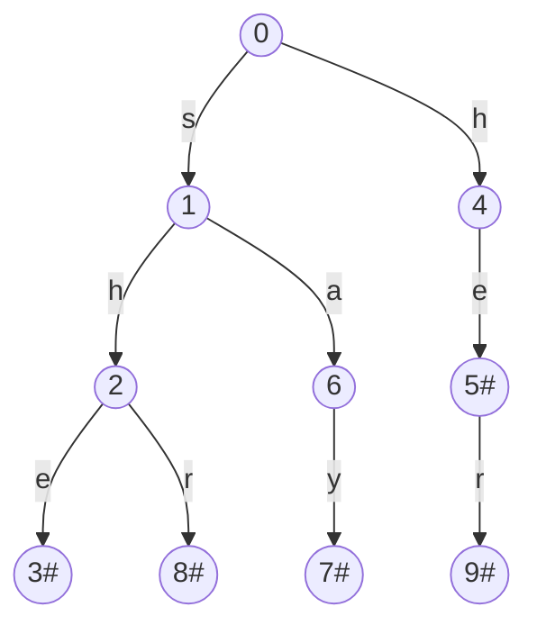

# #

>   献给正在奋斗的大家，你们给予了我前进的动力。

## 问题

现有一**多字符串匹配**的问题：

>   假设字典中有串：she, he, say, shr, her
>
>   现在有目标串yasherhs，求目标串中包含了哪些字典串？

## Trie树

trie树的实现了前缀匹配的问题，又叫前缀树。

现在对刚才的问题构造trie树。

利用前缀匹配法来匹配目标串的所有后缀。

时间复杂度为$O(n^2*h)$，$n$为目标串长度，$h$为trie树高。

## AC-Tree

AC-Tree = Trie Tree + KMP

在AC-Tree中，引入了一个失配指针来模拟KMP算法。