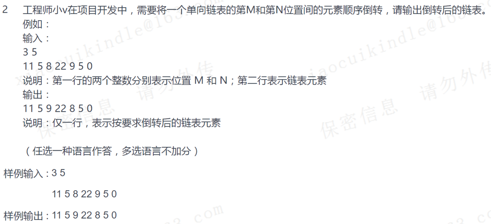

# #

部分链表逆序



代码如下：

```c++
#include <iostream>
#include <cstdlib>
using namespace std;

// Welcome to vivo !

struct node{
    int data;
    struct node *next;
};

struct node *listCreate(void)
{
    struct node *Head=NULL;
    
    Head = (struct node *)malloc(sizeof(struct node));
    if(!Head){
        cout<<"out of memory."<<endl;
        return NULL;
    }
    Head->data = 0;
    Head->next = NULL;
    
    return Head;
}

int input(struct node *head, int *len)
{
    struct node *pos, *n;
    int i=0;
    
    pos=head;
    if(!pos) {
        cout<<"list not exist!"<<endl;
        return -1;
    }
    do{
        i++;
        cin>>pos->data;
        n = (struct node *)malloc(sizeof(struct node));
        if(!n){
            cout<<"out of memory."<<endl;
            return -1;
        }
        n->data = 0;
        n->next = NULL;
        
        pos->next = n;
        pos = pos->next;
    }while(cin.get()!='\n');
    
    *len=i;
    
    return 0;
}

int printList(struct node *head, int len)
{
    struct node *pos = head;
    while(pos && len>0) {
        len--;
        cout<<pos->data<<" ";
        pos=pos->next;
    }
    cout<<endl;
    
    return 0;
}

void freelist(struct node *head)
{
    struct node *pos;
    
    while(head) {
        pos=head;
        head=head->next;
        free(pos);
    }
}


int listExchangeOrder(struct node *&head, int from, int to)
{
    if (from >=  to) return 0;
    node *p(head);  // 反转链表开始前一的结点
    node *b;        // 反转链表开始结点
    if (from == 1){
        p = 0;
        b = head;
    }else{
        while (from -2){
            p = p->next;
            --from;
        }
        b = p->next;
    }
    node *q;
    node *e(head);
    while (to - 1){
        e = e->next;
        --to;
    }
    q = e->next;
    e->next = 0;

    
    node* s(b);
    node* t(s->next);
    node* l(t->next);
    s->next = q;

    // three point to reverse link table
    while (t){
        t->next = s;
        s = t;
        t = l;
        if (l) l = l->next;
    }

    if (p) p->next = s;
    else head = s;


    return 0;
}

int main(void)
{
    struct node *Head=NULL;
    int from=0, to=0, len=0;
    cout << "input from and to: ";
    cin>>from>>to;
    Head=listCreate();
    input(Head, &len);
    listExchangeOrder(Head,from,to);
    printList(Head,len);
    freelist(Head);
}

```

