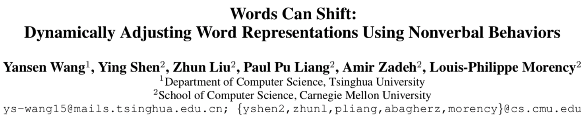
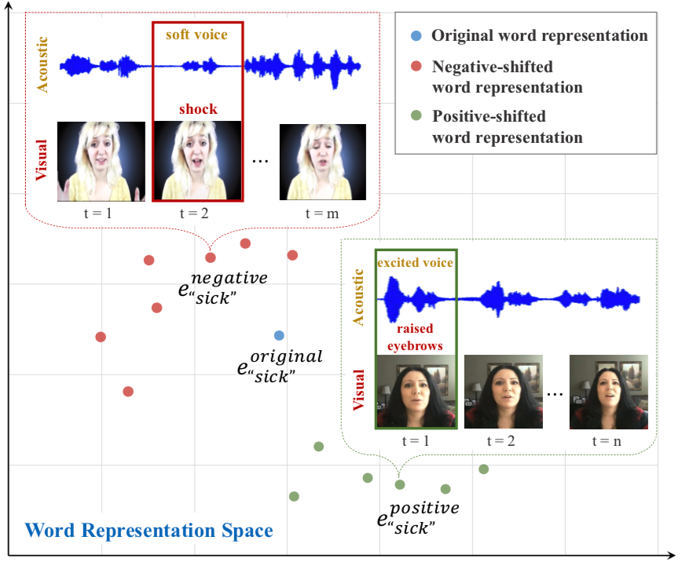
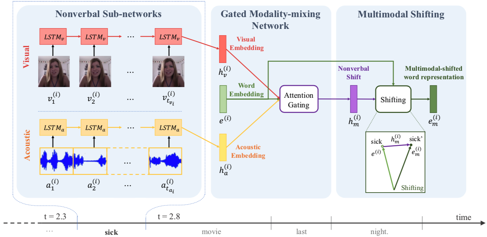
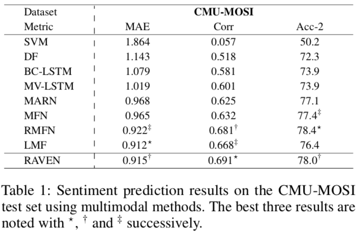
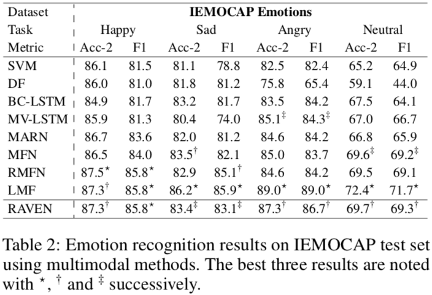
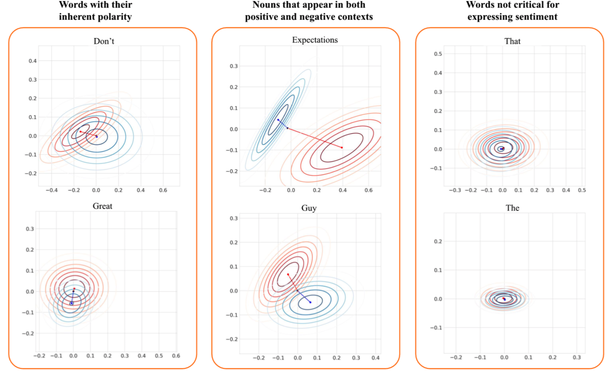
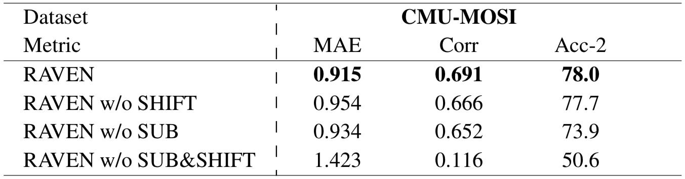

# 1

[TOC]

## 概览-总结

* AAAI 2019

* 本篇论文研究的内容是，非文本的多模态数据对**文本情感极性**的影响。
* 在日常生活中，除了说话的内容文本，说话时的语调、面部表情、手势等等音频-视觉信息也是影响情感表达的重要部分。单纯利用**文本词嵌入**进行情感识别，会忽略掉重要的非文本的多模态信息。
* 本文提出了一个多模态情感分析模型，能够根据音频-视觉的多模态信息来动态地调整词嵌入的情感极性。
    * 首先，模型根据文本中的每一个单词切分出对应的音频和视频片段，并利用LSTM分别对音频-视觉信息进行特征提取。
    * 然后，上一步抽取出的特征流入**门控模态混合网络**，该网络利用原始单词的词向量，以跨模态注意力的方式，来计算非文本特征的调整值。
    * 最后，加权合并原始词向量和对应的调整值，得到最终的多模态调整的词向量。
* 该模型使用了
    * 多模态对齐：单词和相应的音-视频信息的对正；
    * 多模态融合机制(门控注意力)：融合不同模态之间的相关特征(视频-文本、音频-文本)，最后用加权和的方式对文本特征进行调整；
    * 多模态表示：文本与非文本特征的联合表示。
* 结果比得上现有的情感分析模型。
* 作者提供了[源码](https://github.com/victorywys/RAVEN)，但是我没有调通。
* 可能存在的问题：
    * 时间成本可能有点高。
    * 多模态注意力的实现方式有待商榷。

---

## 背景

- 视频情感分析
- 面对面谈话时，人们通过言语信息和语调、手势等信息传达他们的意图。

### 现象
* 文本模态提供了单词和句子，非文本模态提供了手势和声音等信息。
* cultural shift 和 different political backgrounds 导致了文本含义的差异。

### 当下的研究状况
#### 文本表示
* word embedding 通过大量的文本语料库来对语言的含义进行表示与建模，这对理解人类高度多模态语言是不够的：

    
    
    在图中，sick 所表示的含义可因为人们不同的面部语言和语气等等**非言语信息**发生变化。
    
    

#### subword analysis (逐字分析)
* 与说话并发的非文本内容，需要细粒度的逐字分析。
* 视觉和声音行为与文本内容相比，通常有着更高的时频(可能指的是抽样频率较高)。
* 过去的研究在分析单字的非文本信息时，大多是简单的平均策略。

---

## 方法

Recurrent Attended Variation Embedding Network (RAVEN)
循环注意力差异嵌入网络——由三个子模块组成

### Nonverbal Sub-networks

* $\mathbf{L}$表示文本序列，伴随着视频$\mathbf{V}$和音频$\mathbf{A}$序列。

* 根据序列中的第$i$个单词$\mathbf{L}^{(i)}$，对音-视频进行切割，得到音-视频的表示序列；
$$
\mathbf{V}^{(i)}=\left[v_{1}^{(i)}, v_{2}^{(i)}, \cdots, v_{t_{v_{i}}}^{(i)}\right], \mathbf{A}^{(i)}=\left[a_{1}^{(i)}, a_{2}^{(i)}, \cdots, a_{t_{a_{i}}}^{(i)}\right]
$$

​	$\mathbf{V}^{(i)}$和$\mathbf{A}^{(i)}$中的每一项代表了视-音频的一帧。

* 将第$i$部分的音频、视频利用LSTM进行特征抽取，将final states作为它们的表示；
  $$
  \begin{array}{l}{\mathbf{h}_{v}^{(i)}=\operatorname{LSTM}_{v}\left(\mathbf{V}^{(i)}\right)} \\ {\mathbf{h}_{a}^{(i)}=\operatorname{LSTM}_{a}\left(\mathbf{A}^{(i)}\right)}\end{array}
  $$
  
### Gated Modality-mixing Network

* 取决于正在说出的单词和音-视频信息，音-视频嵌入的相对重要性可能会变化。

* 利用**注意力门控**机制动态地对音频、视觉模态嵌入进行非线性融合：

* $$
  \begin{aligned} w_{v}^{(i)} &=\sigma\left(\mathbf{W}_{h v}\left[\mathbf{h}_{v}^{(i)} ; \mathbf{e}^{(i)}\right]+b_{v}\right) \\ w_{a}^{(i)} &=\sigma\left(\mathbf{W}_{h a}\left[\mathbf{h}_{a}^{(i)} ; \mathbf{e}^{(i)}\right]+b_{a}\right) \end{aligned}
  $$

  $\mathbf{e}^{(i)}$是$\mathbf{L}^{(i)}$对应的词向量。
  
* the nonverbal shift vector 
  $$
  \mathbf{h}_{m}^{(i)}=w_{v}^{(i)} \cdot\left(\mathbf{W}_{v} \mathbf{h}_{v}^{(i)}\right)+w_{a}^{(i)} \cdot\left(\mathbf{W}_{a} \mathbf{h}_{a}^{(i)}\right)+\mathbf{b}_{h}^{(i)}
  $$
  

### Multimodal Shifting

* 整合非言语偏移向量$\mathbf{h}_{m}^{(i)}$到原始的词向量中，将词向量动态地偏移。
  
* 获得multimodal-shifted word representations，其中$e^{(i)}$为原始词嵌入，$\alpha$为比例因子来限制非言语模态的影响。
  $$
  \begin{aligned} \mathbf{e}_{m}^{(i)} &=\mathbf{e}^{(i)}+\alpha \mathbf{h}_{m}^{(i)} \\ \alpha &=\min \left(\frac{\left\|\mathbf{e}^{(i)}\right\|_{2}}{\left\|\mathbf{h}_{m}^{(i)}\right\|_{2}} \beta, 1\right) \end{aligned}
  $$
  
* 多模态序列$\bold{(L, V, A)}$被转化为了表示$\bold{E}=[e_{m}^{(1)}, e_m^{(2)},...e_m^{(n)}]$

* 可以简单利用一个词级别的LSTM来对multimodal-shifted word representations进行特征抽取。
  $$
  \mathbf{h}=\operatorname{LSTM}_{e}(\mathbf{E})
  $$
  

---

## 实验

### Datasets
三模态人类交流-情感识别数据集**CMU-MOS**和**ICMPCAP**.

### SOA对比试验

1. CMU-MOSI 

   

2. ICMPCAP

   

   

### 语言极性

某个单词出现在积极上下文中，与出现在消极上下文中的高斯轮廓，大概能反映出它的极性吧……

> 1. 将CMU-MOSI中所有出现的词向量映射到二维空间当中，将这些点的重心设为原点；
> 2. 蓝色箭头表示含有积极情绪上下文的重心，红色箭头表示含有消极上下文的重心；

* 对于本身具有极性的词，与它对立的情感上下文影响对其极性的影响较大；与它一致的情感上下文对其极性的影响很小。
* 对于本身无极性的名词，积极消极的上下文对其影响都很大。
* 对于停用词，情感上下文对其的影响都很小。可能是它们本身就无意义？

### 功能简化实验
测试了两个主要部分： Nonverbal Subnetworks 和 Multimodal Shifting. Visual and acoustic representations 对模型效果的影响。

