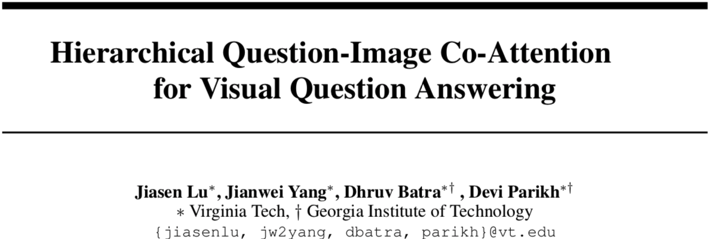
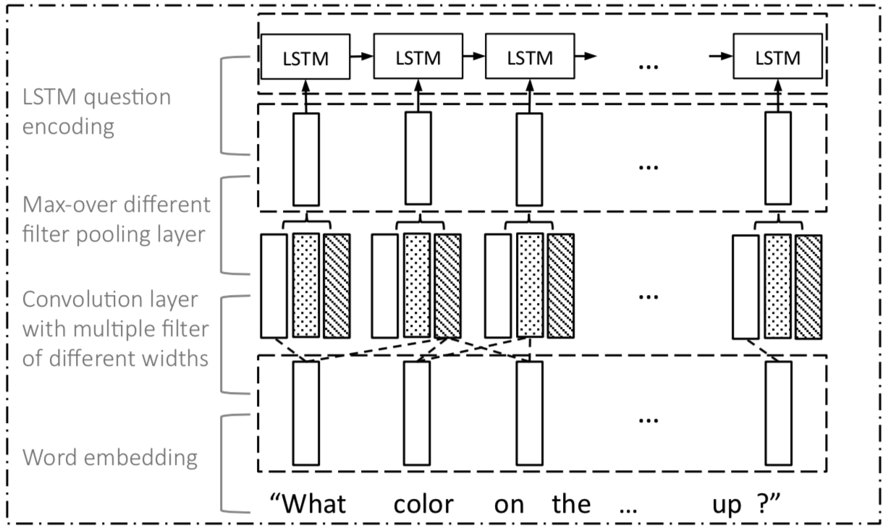
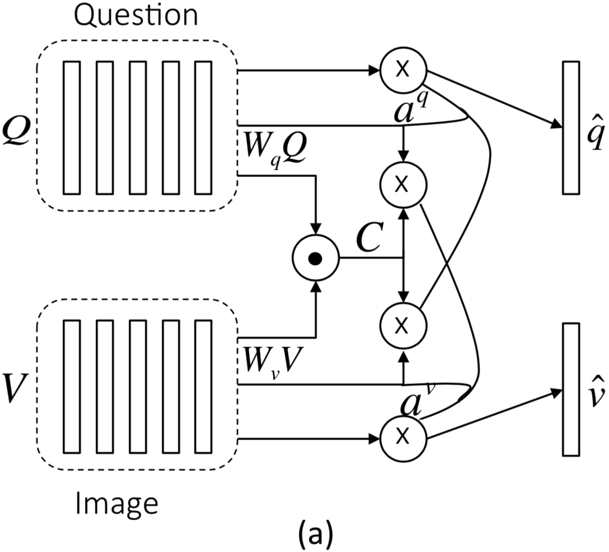
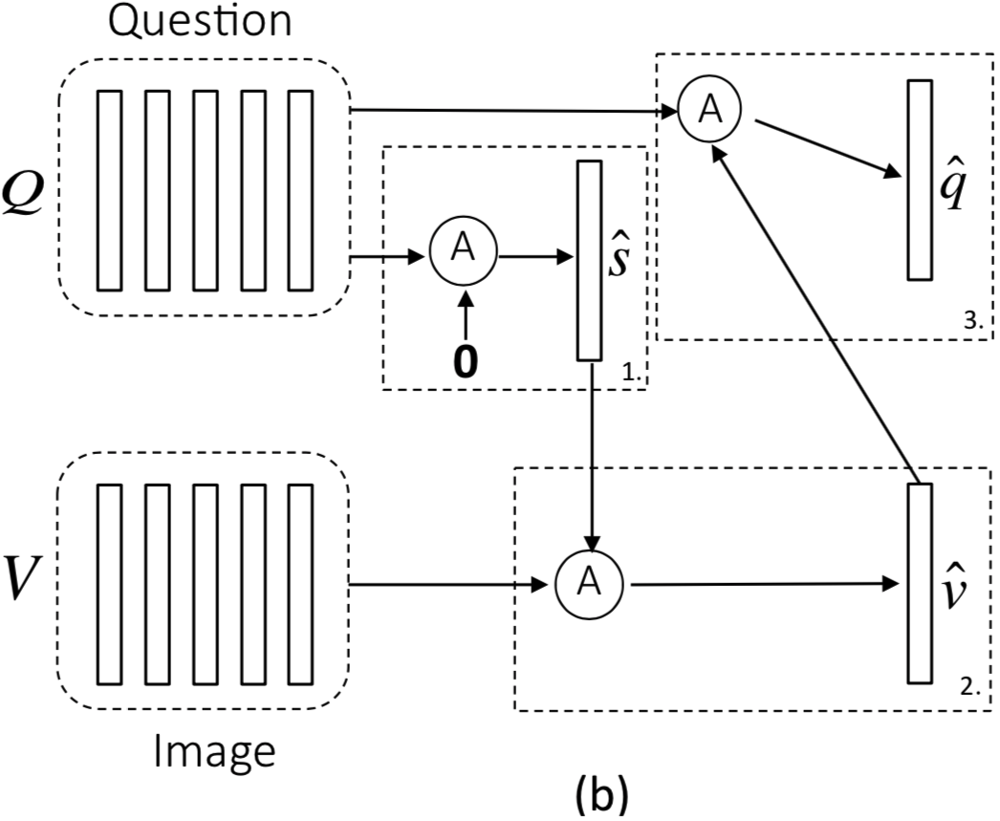
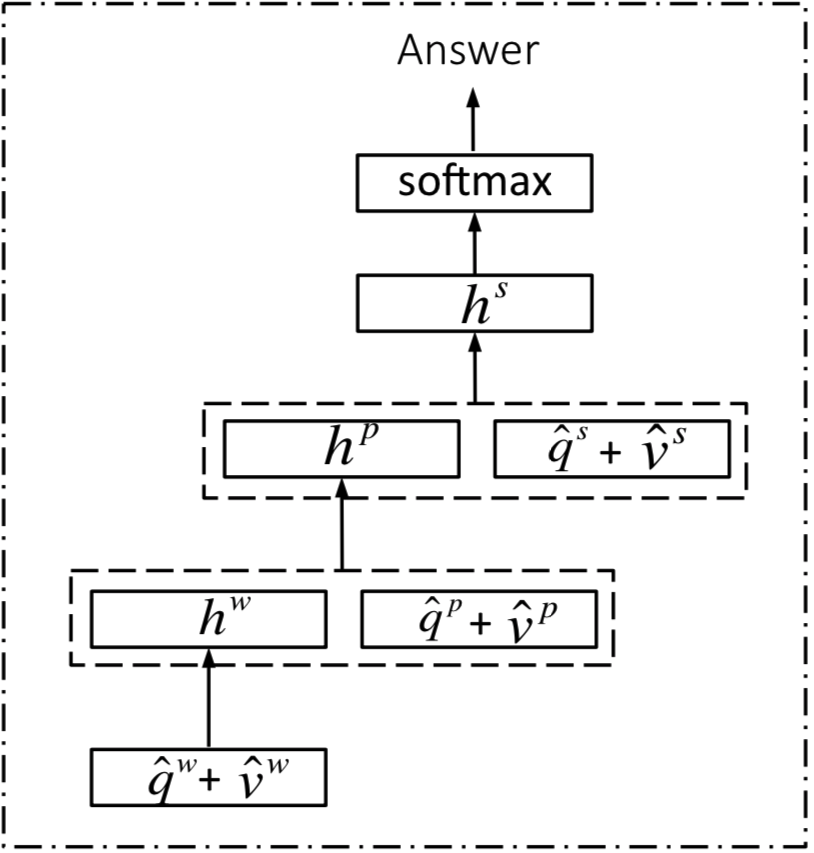

# 2

[TOC]

## 概览+总结

* NIPS 2016
* 本文解决的问题是VQA。
* 主要在两个地方对VQA的效果进行提升：
    1. Co-Attention (互注意力机制)
    相比于以往仅仅使用了视觉注意力机制的工作，本方法对图像和文本都采用了注意力机制(用文本特征计算图像注意力，反之亦然)。作者提供了两种计算co-attention的方案：平行计算和交替计算。方案各有优劣。一般来说，平行计算效果较好，但是由于涉及到矩阵相乘运算导致训练困难；交替运算会因为错误传递使效果变差。
    2. Question Hierarchy (问题层次特征)
    在单词级、短语级和句子级三个级别上对文本的特征进行抽取。**单词级**的特征即为词向量。**短语级**的文本特征由一维CNN抽取问句而来，先利用三个拥有不同大小卷积窗口的滤波器(一个单词、两个单词和三个单词)对原始问题进行特征抽取；再利用最大池化选取最符合的短语级特征。利用循环神经网络来抽取**整个问题**特征。
    每一个特征层次(除问题级)中获得的问题特征都要和图像特征计算一次Co-Attention。然后从词级特征开始，递归地融合不同级别的文本-图像联合特征。将最终生成的表示用来预测问题的答案。
* 实验采用的数据集为VQA和COCO-QA.
* SOA模型比较实验结果表明，本方法效果较好。且每一个部分对最终的结果都有影响。
* 不足之处：
    1.  没有从理论上说明为什么要这样设计？

---

## Method 

### Notation

* 含有$T$个单词的问题表示为$\boldsymbol{Q}=\left\{\boldsymbol{q}_{1}, \ldots \boldsymbol{q}_{T}\right\}$，其中$\boldsymbol{q}_{t}$是第$t$个单词的特征向量。$\boldsymbol{q}_{t}^{w}, \boldsymbol{q}_{t}^{p} \text { and } \boldsymbol{q}_{t}^{s}$作为第$t$位置的词嵌入、短语嵌入和问题嵌入。
* 图像特征表示为$\boldsymbol{V}=\left\{\boldsymbol{v}_{1}, \ldots, \boldsymbol{v}_{N}\right\}$，$\boldsymbol{v}_{n}$是第$n$个空间位置的特征向量。
* 每一个问题层次表示的联合注意力表示为$\hat{\boldsymbol{v}}^{r} \text { and } \hat{\boldsymbol{q}}^{r} \text { where } r \in\{w, p, s\}$.

### Question Hierarchy

#### 短语级特征抽取

对于每个单词，使用三个窗口大小不同的滤波器进行特征抽取，然后利用最大池化选择最合适的特征。

* 利用一维卷积核来抽取短语特征，对于第$t$个位置的单词，窗口大小为$s$的卷积输出表示为：
  $$
  \hat{\boldsymbol{q}}_{s, t}^{p}=\tanh \left(\boldsymbol{W}_{c}^{s} \boldsymbol{q}_{t : t+s-1}^{w}\right), \quad s \in\{1,2,3\}
  $$

* 利用max-pooling获得每个位置上的短语特征：
  $$
  \boldsymbol{q}_{t}^{p}=\max \left(\hat{\boldsymbol{q}}_{1, t}^{p}, \hat{\boldsymbol{q}}_{2, t}^{p}, \hat{\boldsymbol{q}}_{3, t}^{p}\right), \quad t \in\{1,2, \ldots, T\}
  $$
  

### Co-Attention

>   Co-Attention机制在VQA领域中的应用是非常自然的，因为任务本身就要求计算与图像相关的文本。

设计了两种注意力机制，计算顺序不同。

#### Parallel Co-Attention

*   同时计算文本-图像的注意力。

*   通过计算所有图像区域-问题区域对来计算特征相似度。

    *   给定图像特征图$\boldsymbol{V} \in \mathcal{R}^{d \times N}$，问题特征$\boldsymbol{Q} \in \mathcal{R}^{d \times T}$
    *   先计算仿射矩阵$\boldsymbol{C} \in \mathcal{R}^{T \times N}$ (权值网络映射)

    $$
    \boldsymbol{C}=\tanh \left(\boldsymbol{Q}^{T} \boldsymbol{W}_{b} \boldsymbol{V}\right)
    $$

    ​	这里已经可以利用简单地最大化仿射矩阵$\boldsymbol{C}$中另一个模态的位置，来计算注意力向量：
    $$
    \boldsymbol{a}^{v}[n]=\max _{i}\left(\boldsymbol{C}_{i, n}\right) \\ \boldsymbol{a}^{q}[t]=\max _{j}\left(\boldsymbol{C}_{t, j}\right)
    $$
    ​	通过实验发现，这样的效果比不上将$\boldsymbol{C}$作为特征来预测attention maps的效果。

    *   将$\boldsymbol{C}$看作特征，预测图像和问题的attention maps: $\boldsymbol{a}^{v}\in\mathcal{R}^N$, $\boldsymbol{a}^{q}\in\mathcal{R}^T$
        $$
        \begin{array}{c}{\boldsymbol{H}^{v}=\tanh \left(\boldsymbol{W}_{v} 			\boldsymbol{V}+\left(\boldsymbol{W}_{q} \boldsymbol{Q}\right) \boldsymbol{C}\right), \quad \boldsymbol{H}^{q}=\tanh \left(\boldsymbol{W}_{q} \boldsymbol{Q}+\left(\boldsymbol{W}_{v} \boldsymbol{V}\right) \boldsymbol{C}^{T}\right)} \\ {\boldsymbol{a}^{v}=\operatorname{softmax}\left(\boldsymbol{w}_{h v}^{T} \boldsymbol{H}^{v}\right), \quad \boldsymbol{a}^{q}=\operatorname{softmax}\left(\boldsymbol{w}_{h q}^{T} \boldsymbol{H}^{q}\right)}\end{array}
        $$
        其中，
        $$
        \boldsymbol{W}_{v}, \boldsymbol{W}_{q} \in \mathcal{R}^{k \times d}\\
        \boldsymbol{w}_{h v}, \boldsymbol{w}_{h q} \in \mathcal{R}^{k}\\
        \boldsymbol{a}^{v} \in \mathcal{R}^{N} \text {, } \boldsymbol{a}^{q} \in \mathcal{R}^{T}
        $$

    *   基于上面计算的attention maps，图像和问题的注意力特征可以用带权和计算出来：
        $$
        \hat{\boldsymbol{v}}=\sum_{n=1}^{N} a_{n}^{v} \boldsymbol{v}_{n}, \quad \hat{\boldsymbol{q}}=\sum_{t=1}^{T} a_{t}^{q} \boldsymbol{q}_{t}
        $$

#### Alternating Co-Attention

*   交替地计算图像和问题的注意力，分为3步：

    1.  将问题总结为单个向量$\boldsymbol{q}$；

    2.  基于$\boldsymbol{q}$计算图像注意力特征；

    3.  基于图像注意力特征计算问题特征。

* 定义一个注意力操作 $\hat{\boldsymbol{x}}=\mathcal{A}(\boldsymbol{X} ; \boldsymbol{g})$ 如下：

$$
\begin{aligned} \boldsymbol{H} &=\tanh \left(\boldsymbol{W}_{x} \boldsymbol{X}+\left(\boldsymbol{W}_{g} \boldsymbol{g}\right) \boldsymbol{1}^{T}\right) \\ \boldsymbol{a}^{x} &=\operatorname{softmax}\left(\boldsymbol{w}_{h x}^{T} \boldsymbol{H}\right) \\ \hat{\boldsymbol{x}} &=\sum a_{i}^{x} \boldsymbol{x}_{i} \end{aligned}
$$
​	其中$\boldsymbol{W}_{x}, \boldsymbol{W}_{g} \in \mathcal{R}^{k \times d} \text { and } \boldsymbol{w}_{h x} \in \mathcal{R}^{k}$，$\boldsymbol{1}$为元素值都为1的向量。

​	计算出的$\hat{\boldsymbol{x}}\in\mathcal{R}^d$

​	文中一共执行了三次这样的操作：
$$
\boldsymbol{X}=\boldsymbol{Q}; \boldsymbol{g}=\boldsymbol{0}\rightarrow\boldsymbol{\hat{s}}\\
\boldsymbol{X}=\boldsymbol{V}; \boldsymbol{g}=\boldsymbol{\hat{s}}\rightarrow\boldsymbol{\hat{v}}\\
\boldsymbol{X}=\boldsymbol{Q}; \boldsymbol{g}=\boldsymbol{\hat{v}}\rightarrow\boldsymbol{\hat{q}}
$$

### 预测特征的构建

* 将VQA看作是分类任务，利用多层感知机递归地对注意力向量进行编码。

$$
\begin{aligned} \boldsymbol{h}^{w} &=\tanh \left(\boldsymbol{W}_{w}\left(\hat{\boldsymbol{q}}^{\boldsymbol{w}}+\hat{\boldsymbol{v}}^{\boldsymbol{w}}\right)\right) \\ \boldsymbol{h}^{p} &=\tanh \left(\boldsymbol{W}_{p}\left[\left(\hat{\boldsymbol{q}}^{\boldsymbol{p}}+\hat{\boldsymbol{v}}^{\boldsymbol{p}}\right), \boldsymbol{h}^{w}\right]\right) \\ \boldsymbol{h}^{s} &=\tanh \left(\boldsymbol{W}_{s}\left[\left(\hat{\boldsymbol{q}}^{s}+\hat{\boldsymbol{v}}^{s}\right), \boldsymbol{h}^{p}\right]\right) \\ \boldsymbol{p} &=\operatorname{softmax}\left(\boldsymbol{W}_{h} \boldsymbol{h}^{s}\right) \end{aligned}
$$

## 实验

### Datasets

**VQA**和**COCO-QA**

