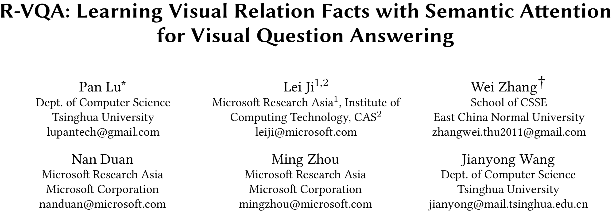
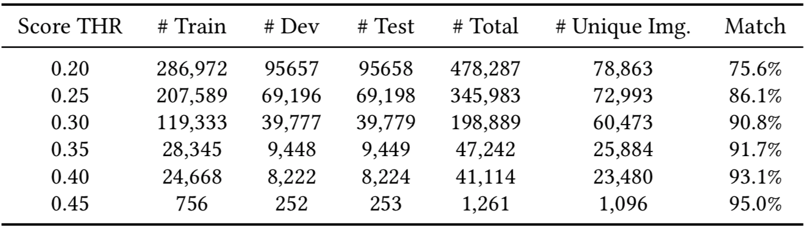
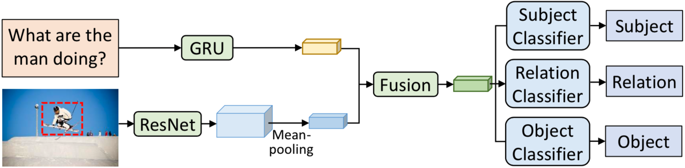
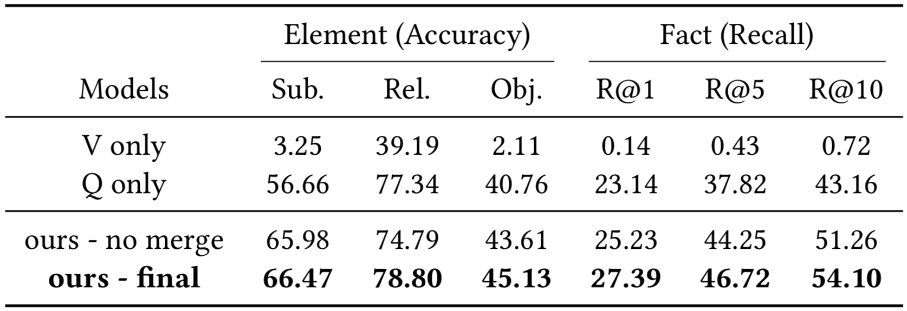
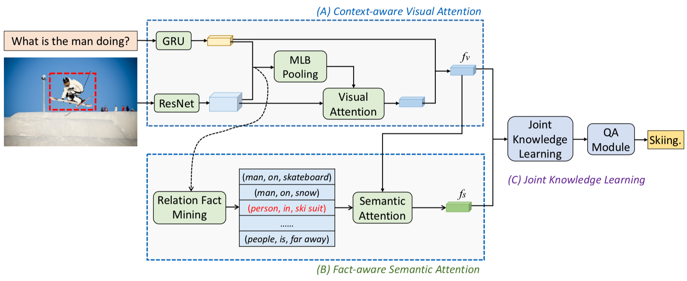

# 3

[TOC]

## 概览-总结

* 本文的任务是VQA，将此任务看作一个多分类问题。
* 亮点有二：
    1. 设计了一个视觉关系侦测器来抽取图像中与问题文本相关的关系。
    2. 利用**多步注意力**网络结合语义和视觉的关系。

* 为了训练关系侦测器，作者在Visual Gnome的基础上创建了一个新的数据集R-VQA

## Introduction
### 背景
* 过去的方法都是用一个RNN来抽取语言特征嵌入，一个预训练的模型抽取图像的特征嵌入，再传入到一个序列网络中生成自由格式的答案或者分类器来预测最相关的答案。
* 图像中的relation facts拥有着更强的语义，因为一个关系包含了：主语实体、关系和宾语实体。
* VQA的**主要挑战**来源于语言到图像之间的语义差距。目前引入了语义知识的方法都局限在两个层面：
    * 利用实体和属性作为高阶的语义概念，这些概念只能覆盖有限的知识；
    * 因为利用了现有的CV方法来抽取图像特征，这些特征可能与VQA任务不相关。

### 方法
1. 构建了一个大规模数据集*Relation-VQA*
2. 关系侦测器
3. 多步注意力模型

## Relation Fact Detector
### 1. 构建R-VQA
简单描述R-VQA的构建过程：
1. 整个数据集基于 *Visual Gnome* ，在VG中，大多数图像都有与之相关的QA问答对，部分图像附有相关语义知识。构建过程中保留同时具有问答对和语义知识的样例；
2. 利用 *Reponse Ranking* (一个语义排序方法)来计算问题和对应语义知识之间的相似度，舍弃掉相似度小于某个阈值的样例；
3. 对不同阈值生成的样例进行 *人工评估*，评估的结果如下表：

### 2. 关系侦测器

* 给定输入的图像和问题，将关系侦测看作为一个多分类任务。
    * 图像嵌入：ResNet-152，最后卷积层的输出看作为 *图像空间表示*(包含了该图像不同部分的特征)。用 *空间平均池化* 来抽取一个紧密的图像表示$v \in \mathcal{R}^{2048}$：
    $$
        v=\text { Meanpooling }(\mathrm{CNN}(I)),
    $$
    * 文字嵌入：GRU抽取问题的语义特征$q \in \mathcal{R}^{2400}$：
    $$
    q=\operatorname{GRU}(Q).
    $$
    * 将图像和问题嵌入到一个**共享的语义空间中**：
    $$
        f_{v}=\tanh \left(W_{v} v+b_{v}\right), f_{q}=\tanh \left(W_{q} q+b_{q}\right),
    $$
    * 学习**联合语义特征嵌入**：
    $$
     h=\tanh \left(W_{v h} f_{v}+W_{g h} f_{q}+b_{h}\right).
    $$
    * 利用**线性分类器**来预测主谓宾：
    $$
        \begin{aligned} 
        p_{s u b} &=\operatorname{softmax}\left(W_{h s} h+b_{s}\right) \\         p_{r e l} &=\operatorname{softmax}\left(W_{h r} h+b_{r}\right) \\         p_{o b j} &=\operatorname{softmax}\left(W_{h o} h+b_{o}\right)           \end{aligned}
    $$
    * 损失函数为：
    $$
    L_{t}=\lambda_{s} L(s, \hat{s})+\lambda_{r} L(r, \hat{r})+\lambda_{o} L(o, \hat{o})+\lambda_{w}\|W\|_{2}
    $$

* 在执行训练之前，需要进行**数据预处理**：合并相似或者相同的 *关系*：on(on the top of/is on), tree(trees).
    * 结果：
    
    
* 为什么不用现有的关系侦测方法？
  
    * 现有的关系侦测没有实现**和问题相关的关系**侦测。

## Visual Question Answering With Facts

### A. Context-aware Visual Attention

#### Visual Attention
* 利用 *mulitmodal low-rank bilinear pooling (MLB)* 来合并问题和图像的表示：
    $$
        c=\operatorname{MLB}(q, v)
    $$
    
* 通过 *线性转化+softmax*层 将合并的表示映射为**视觉注意力权重**： 
    $$
        m=\operatorname{softmax}\left(W_{c} c+b_{c}\right)
    $$

* 基于注意力权重，计算图像的整体表示：
    $$
    \tilde{v}=\sum_{i=1}^{14 \times 14} m(i) v(i)
    $$
    
* 合并视觉特征和图像特征：
    $$
    f_{v}=\tilde{v} \circ \tanh \left(W_{q} q+b_{q}\right)
    $$
    
    $\circ$表示逐元素相乘。

### B. Fact-aware Semantic Attention

* 最有可能的$K$个关系组成一个候选集$T=\left[t_{1} ; t_{2} ; \ldots ; t_{K}\right]$，对于每一个关系$t_{i}=\left(s_{i}, r_{i}, o_{i}\right)$，将其中的每一个元素都嵌入到一个共有语义空间$\mathcal{R}^n$中，并且串联这三个元素嵌入组成**关系嵌入**：
    $$
    f_{t_{i}}=\left[W_{s h} s_{i}, W_{r h} r_{i}, W_{o h} o_{i}\right] \in \mathcal{R}^{3 n}
    $$
    我们可以得到$K$个关系嵌入的向量$f_{T}=\left[f_{t_{1}} ; f_{t_{2}} ; \ldots ; f_{t_{K}}\right] \in \mathcal{R}^{K \times 3 n}$
    
* 利用上面的视觉特征$f_v$和关系嵌入$f_T$，计算**语义注意力**权重$m_t$：
    $$
        \begin{aligned} c_{t} &=\operatorname{MLB}\left(f_{v}, f_{T}\right) \\ m_{t} &=\operatorname{softmax}\left(W_{c_{t}} c_{t}+b_{c_{t}}\right) \end{aligned}
    $$
* 最终，基于注意力机制，从候选集中得到关系嵌入：
    $$
        f_{S}=\sum_{i=1}^{K} m_{t}(i) f_{T}(i)
    $$
    
### C. Joint Knowledge Learning
* 综上，多步注意力模型包含了两个注意力成分：
    * 视觉注意力机制选择图像中与问题最相关的区域并计算出视觉表示*f_v*；
    * 语义注意力机制选择最相关的关系事实并输出语义知识表示*f_s*；
* 融合两部分表示：
    $$
        h=\tanh \left(W_{v h} f_{v}+b_{v}\right)+\tanh \left(W_{s h} f_{s}+b_{s}\right).
    $$
* 训练一个线性多分类器预测最终的结果：
    $$
    p_{\text {ans}}=\operatorname{softmax}\left(W_{a} h+b_{a}\right).
    $$