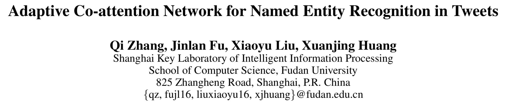

# #

>   献给仍在苦思冥想的你。

[TOC]

---

## 模型

### 特征抽取

#### 图像特征

*   总体：16层VGG-Net，最后池化层的输出作为图像的空间特征(spatial feature).

*   步骤：

    1.  将图像的大小修整到$224 \times 224$像素；

    2.  放入VGG中，保留最后池化层的输出作为图像的特征，该特征的维度为$512 \times 7 \times 7$；

        *   512为特征向量的维度
        *   $7 \times 7$是图像区域的数目

    3.  图像特征：
        $$
        \tilde{v}_{I}=\{\tilde{v}_{i} | \tilde{v}_{i} \in \mathbb{R}^{d_{v}}, i=1,2, \cdots, N \}
        $$

        *   $N=7 \times 7$，为图像区域的数量
        *   $d_{v}=512$，为图像第$i$个区域中特征向量的维度

    4.  利用单层感知机将$\tilde{v}_{I}$的维度转化到与文本特征的维度一致：
        $$
        v_{I}=\tanh \left(W_{I} \tilde{v}_{I}+b_{I}\right)
        $$

    *   $v_I \in  \mathbb{R}^{d \times N}$

    ---

#### 字符特征

*   提取字符特征是为了缓解少见字的问题和捕捉字的形态学特征(前/后缀等)。

*   步骤：

    1.  给定字符的词汇表$C$，对照$C$将一个单词编码为一串字符特征序列$\boldsymbol{c}$
        $$
        \boldsymbol{c}=\left[c_{1}, c_{2}, \cdots, c_{m}\right]
        $$

        *   $c_{i} \in \mathbb{R}^{d_{c}}， \boldsymbol{c} \in \mathbb{R}^{d_c \times  m}$
        *   $c_i$表示单词的第$i$个字符，$m$代表单词的长度。

    2.  ==一维卷积==：给定$k$组具有不同窗口大小$\left[l_{1}, l_{2}, \cdots, l_{k}\right]$的滤波器$\left[C_{1}, C_{2}, \cdots, C_{k}\right]$，对字符特征序列$\boldsymbol{c}$作$k$组卷积操作：
        $$
        F_{j}=\left[\cdots ; \tanh \left(C_{j} \odot \boldsymbol{c}_{\left[i : i+l_{j}-1\right]}+b_{j}\right) ; \cdots\right]
        $$

        *   $C_j \in \mathbb{R}^{l_j \times d_c}, F_j \in \mathbb{R}^{m}$
        *   $ i=1,2...m, j=1,2…k$
        *   $\odot$代
        *   $i$表示卷积窗口的位置，$F_j$代表了使用第$j$个卷积核得到的序列

        *   中间可能要进行padding操作

    3.  对特征$F_j$使用==**max-over-time pooling**==：
        $$
        w_{j}^{\prime}=\operatorname{\boldsymbol{max-over-time}} \left(F_{j}\right)
        $$
        将$F_j$中所有元素的最大值$w_{j}^{\prime}$作为卷积核$C_j$抽出的特征。

        *   $w_{j}^{\prime} \in \mathbb{R} $

    4.  一个单词的字符特征表示为每个卷积核抽出特征$w^{\prime}$的串联:
        $$
        w^{\prime}=\left[w_{1}^{\prime} \oplus w_{2}^{\prime} \oplus \cdots w_{k}^{\prime}\right]
        $$

        *   $w^{\prime} \in \mathbb{R}^{k}$

    ---

#### 文本特征

*   利用双向LSTM抽取文本特征。

*   步骤：

    1.  给定一个句子序列$x=\left(x_{0}, x_{1}, \ldots, x_{n}\right)$，先利用CNN抽取字符级别的特征$w^{\prime}$；

    2.  通过词嵌入获得原始的词表示$w^{\prime\prime}$；

    3.  串联每个单词对应的字符向量和词向量：
        $$
        w_{t}=\left[w_{t}^{\prime \prime}, w_{t}^{\prime}\right]
        $$

    4.  将$w={w_1,w_2,…w_n}$输入到BiLSTM中，串联双向$t$时刻的隐含层输出作为第$t$个单词的表示$h_t$
        $$
        h_{t}=\left[\overrightarrow{h_{t}}, \overleftarrow{h_{t}}\right]
        $$
        

    5.  得到最终的文本特征表示
        $$
        x=\left\{h_{j} | h_{j} \in \mathbb{R}^{d}, j=1,2, \cdots, n\right\}
        $$

---

### 自适应协同注意力网络

#### 基于文本的视觉注意力机制 Word-Guided Visual Attention

*   将每一个单词的特征作为Query，图像的每一个区域表示作为Key。

*   利用句子中的第$t$个词的特征$h_t$与图像每一个区域的特征计算注意力：
    $$
    \begin{aligned} z_{t} &=\tanh \left(W_{v_{I}} v_{I} \oplus\left(W_{h_{t}} h_{t}+b_{h_{t}}\right)\right) \\ \alpha_{t} &=\operatorname{softmax}\left(W_{\alpha_{t}} z_{t}+b_{\alpha_{t}}\right) \end{aligned}
    $$

    *   $h_{t} \in \mathbb{R}^{d}$

    *   $v_{I} \in \mathbb{R}^{d \times N}$, $N$为图像区域的数量
    *   $W_{v_{I}}, W_{h_{t}}\in \mathbb{R}^{k \times d}$
    *   $W_{\alpha_{t}} \in \mathbb{R}^{1 \times 2 k}$
    *   $\alpha_{t} \in \mathbb{R}^{N}$
    *   $\oplus$表示串联(列上，即axis=0)

*   与单词表示$h_t$相关的图像表示为：
    $$
    \hat{v}_{t}=\sum_{i} \alpha_{t, i} v_{i}
    $$

    *   $\hat{v}_{t} \in \mathbb{R}^{d}$

---

#### 基于图像的文本注意力机制 Image-Guided Textual Attention

>   这里给出的理由行不行？是不是用self-attention也能解决？

*   基于文本的图像注意力机制计算了与$h_t$相关的图像区域。但是我们并不知道文本中有哪些其他单词和当前时刻的单词更相关。

*   提出了一个新的注意力机制，将新生成的图像表示$\hat{v}_t$作为Query，每个单词的表示作为Key.

*   利用基于$t$的图像特征与文本中的每一个单词计算注意力：

    >   那么我当前单词的权重肯定是最大咯？

    $$
    \begin{aligned} z_{t}^{\prime} &=\tanh \left(W_{x} h \oplus\left(W_{x, \hat{v}_{t}} \hat{v}_{t}+b_{x, \hat{v}_{t}}\right)\right) \\ \beta_{t} &=\operatorname{softmax}\left(W_{\beta_{t}} z_{t}^{\prime}+b_{\beta_{t}}\right) \end{aligned}
    $$

    -   $h=(h_1,h_2,…h_n), h \in \mathbb{R}^{d \times n}$, $n$为句子长度
    -   $\hat{v}_{t} \in \mathbb{R}^{d}$

    -   $W_{x_{}}, W_{x_{t},\hat{v}_{t}}\in \mathbb{R}^{k \times d}$
    -   $z_{t}^{\prime} \in \mathbb{R}^{2k \times n}$
    -   $W_{\beta_{t}} \in \mathbb{R}^{1 \times 2 k}$
    -   $\beta_{t} \in \mathbb{R}^{n}$
    -   $\oplus$表示串联(列上，即axis=0)

*   与单词表示$h_t$相关的文本表示为：
    $$
    \hat{h}_{t}=\sum_{j} \beta_{t, j} h_{j}
    $$

-   $\hat{h}_{t} \in \mathbb{R}^{d}$

---

#### 门控多模态融合 Gated Multimodal Fusion

*   GMF模块对抽取的图像和文本特征将进行融合，形成一个中间表示。

*   步骤，针对于文本中的第t个位置：
    $$
    \begin{aligned} h_{\hat{v}_{t}} &=\tanh \left(W_{\hat{v}_{t}} \hat{v}_{t}+b_{\hat{v}_{t}}\right) \\ h_{\hat{h}_{t}} &=\tanh \left(W_{\hat{h}_{t}} \hat{h}_{t}+b_{\hat{h}_{t}}\right) \\ g_{t} &=\sigma\left(W_{g_{t}}\left(h_{\hat{v}_{t}} \oplus h_{\hat{h}_{t}}\right)\right) \\ m_{t} &=g_{t} h_{\hat{v}_{t}}+\left(1-g_{t}\right) h_{\hat{h}_{t}} \end{aligned}
    $$
    

    *   $h_{\hat{v}_{t}}, h_{\hat{v}_{t}}$表示通过单层感知机计算的文本-图像**新特征**；
    *   $g_t$表示门控单元，关于门控单元的计算方式，还需要继续深入；
    *   $m_t$为计算的多模态融合特征。

---

#### 过滤门 Filtration Gate

*   在实体识别任务中，文本特征是最重要的、不可忽略的特征。

*   在上面计算的多模态特征$m_t$ 中，多少会引入一些视觉特征产生的误差，所以利用一个多虑们来融合我们需要的特征。

*   过滤门$s_t \in [0,1]$，计算过滤门以及通过它来生成$t$位置的融合向量的步骤如下：
    $$
    \begin{aligned} s_{t} &=\sigma\left(W_{s_{t}, h_{t}} h_{t} \oplus\left(W_{m_{t}, s_{t}} m_{t}+b_{m_{t}, s_{t}}\right)\right) \\ u_{t} &=s_{t}\left(\tanh \left(W_{m_{t}} m_{t}+b_{m_{t}}\right)\right) \\ \hat{m}_{t} &=W_{\hat{m}_{t}}\left(h_{t} \oplus u_{t}\right) \end{aligned}
    $$

    *   $h_t$为$t$时刻的文本特征
    *   $u_t$为过滤门过滤完噪音后剩余的多模态表示
    *   $\oplus$表示串联操作

---

### 条件随机场标注模型

nothing interesting

