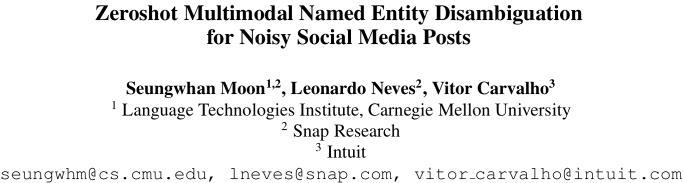
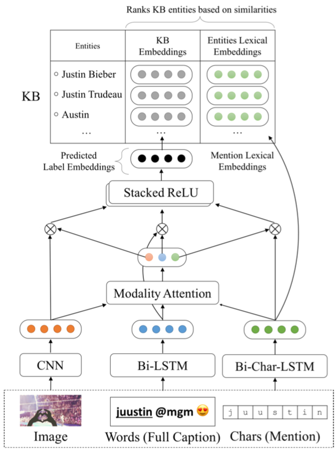
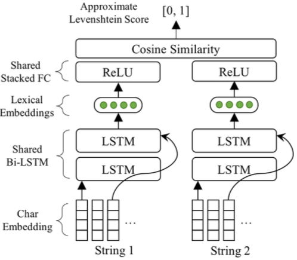

# 1

[TOC]

## 社交中的多模态短文本实体链接

### 难点

#### 社交网络文本的特点

1.  歧义
    *   实体名称的一词多义现象；
    *   不统一，不完整的指称；

2.  实体周围的上下文信息有限；
3.  训练数据中包含了许多纹出现实体。

### 别人家的方案

#### 模型概览

#### 符号表示

1.  社交posts，$\mathbf{X}=\left\{\mathbf{x}^{(i)}\right\}_{i=1}^{N}$表示输入的社交posts样本；每个实体包含了三种信息，即文本、字符与图像，表示为
    $$
    \mathbf{x}=\left\{\mathbf{x}_{w} ; \mathbf{x}_{v} ; \mathbf{x}_{c}\right\}
    $$
    

    *   $\mathbf{x}_{w}=\left\{\mathbf{x}_{w, t}\right\}_{t=1}^{L_{w}}$为环绕在实体周围，长度${L_{w}}$为文本信息

    *   $\mathbf{x}_{c}=\left\{\mathbf{x}_{c, t}\right\}_{t=1}^{L_{c}}$为mention的字符信息

2.  $\mathbf{X}$对应的知识库实体$\mathbf{Y}=\left\{\mathbf{y}^{(i)}\right\}_{i=1}^{N} ， \mathbf{y} \in \mathbf{Y}_{\mathrm{KB}}$，$\mathbf{Y}_{\mathrm{KB}}$代表知识库中的实体

    *   $\mathbf{y}=\left\{\mathbf{y}_{K B} ; \mathbf{y}_{c}\right\}$

3.  多模态命名实体链接任务：
    $$
    \mathbf{y}=\underset{\mathbf{y}^{\prime} \in \mathbf{Y}_{\mathrm{KB}}}{\operatorname{argmax}} \operatorname{sim}\left(\mathbf{f}_{\mathbf{x} \rightarrow \mathbf{y}}(\mathbf{x}), \mathbf{y}^{\prime}\right)
    $$
    

#### 文本特征

*   利用GloVE抽取的词向量特征；

*   双向LSTM获得当前词包含上下文的表示：
    $$
    \mathbf{w}\left(\mathbf{x}_{w}\right)=\left[\overrightarrow{\mathbf{h}_{L_{w}}} ; \overleftarrow{\mathbf{h}_{L_{w}}}\right]
    $$

#### 视觉特征

*   利用GoogLeNet抽取图像的特征，捕捉图像中包含哪些实体的信息。

*   在ImageNet的图像分类任务上作训练

#### 词汇嵌入 Deep Levenshtein

*   社交网络环境下，不可避免地包括了拼写错误和不一致的表达；

*   为了解决这些不对应的问题，作者单独训练了一个深度神经网络Deep Levenshtein来计算近似的编辑距离，其优化目标为：
    $$
    \begin{array}{c}{\min _{\mathbf{c}}\left\|\frac{1}{2}\left(\frac{\mathbf{c}\left(\mathbf{x}_{c}\right) \cdot \mathbf{c}\left(\mathbf{x}_{c}^{\prime}\right)^{\top}}{\left\|\mathbf{c}\left(\mathbf{x}_{c}\right)\right\|\left\|\mathbf{c}\left(\mathbf{x}_{c}^{\prime}\right)\right\|}+1\right)-\operatorname{sim}\left(\mathbf{x}_{c}, \mathbf{x}_{c}^{\prime}\right)\right\|^{2}} \\ {\text { where } \mathbf{c}\left(\mathbf{x}_{c}\right)=\left[\overrightarrow{\mathbf{h}_{c, L_{c}}} ; \overleftarrow{\mathbf{h}_{c, L_{c}}}\right]}\end{array}
    $$

    *   $\mathbf{c}(\cdot)$为双向LSTM的输出
    *   $\operatorname{sim}(\cdot)$为Deep Levenshtein的输出
    *   $\left(\mathbf{x}_{c}, \mathbf{x}_{c}^{\prime}\right)$训练数据，为一对字符串，作者通过添加、删除、替换等方法，手动地生成了一百万对训练数据。

*   纯粹的字符级嵌入，不掺杂任何语义信息；

*   该神经网络的副产品$\mathbf{c}(\cdot)$抽取字符级特征。

#### 知识图谱的实体表示 (此处可以改进)

*   为了解决零样本学习的问题，将知识图谱表示为带有语义的嵌入；
*   Holographic KB嵌入方法来获得知识图谱的实体嵌入；

#### 训练目标

*   Deep Zeroshot MNED network (DZMNED)
    $$
    \begin{aligned}
    \mathcal{Loss}&={\min_{\mathbf{W}} \mathcal{L}_{\mathrm{KB}}\left(\mathbf{x}, \mathbf{y}_{\mathrm{KB}} ; \mathbf{W}_{\mathbf{w}}, \mathbf{W}_{\mathbf{v}}, \mathbf{W}_{\mathbf{f}}\right)+\mathcal{L}_{c}\left(\mathbf{x}_{c}, \mathbf{y}_{c} ; \mathbf{W}_{\mathbf{c}}\right)} \\ {\text { where }} \\ {\mathcal{L}_{\mathrm{KB}}(\cdot)}&=\frac{1}{N} \sum_{i=1}^{N} \sum_{\\\tilde{\mathbf{y}} \neq \mathbf{y}_{\mathrm{kB}}^{(i)}} \max \left[0, \tilde{\mathbf{y}} \cdot \mathbf{y}_{\mathrm{KB}}^{(i)}-\mathbf{f}\left(\overline{\mathbf{x}}^{(i)}\right) \cdot\left(\mathbf{y}_{\mathrm{KB}}^{(i)}-\tilde{\mathbf{y}}\right)^{\top}\right]\\\mathcal{L}_{c}(\cdot)&=\frac{1}{N} \sum_{i=1}^{N} \sum_{\tilde{\mathbf{y}} \neq \mathbf{y}_{c}^{(i)}} \max \left[0, \tilde{\mathbf{y}} \cdot \mathbf{y}_{c}^{(i)}-\mathbf{c}\left(\mathbf{x}_{c}^{(i)}\right) \cdot\left(\mathbf{y}_{c}^{(i)}-\tilde{\mathbf{y}}\right)^{\top}\right]\\\end{aligned}
    $$

#### 注意力机制

$$
\begin{aligned}\left[\mathbf{a}_{w} ; \mathbf{a}_{c} ; \mathbf{a}_{v}\right]&=\sigma\left(\mathbf{W}_{m} \cdot\left[\mathbf{x}_w ; \mathbf{x}_c ; \mathbf{x}_{v}\right]+\mathbf{b}_{m}\right) &(4) \\ \alpha_{m}=& \frac{\exp \left(\mathbf{a}_{m}\right)}{\sum \exp \left(\mathbf{a}_{m^{\prime}}\right)} \quad \forall m \in\{w, c, v\} \\ \overline{\mathbf{x}}=& \sum_{m \in\{w, c, v\}} \alpha_{m} \mathbf{x}_{m} \end{aligned}
$$

