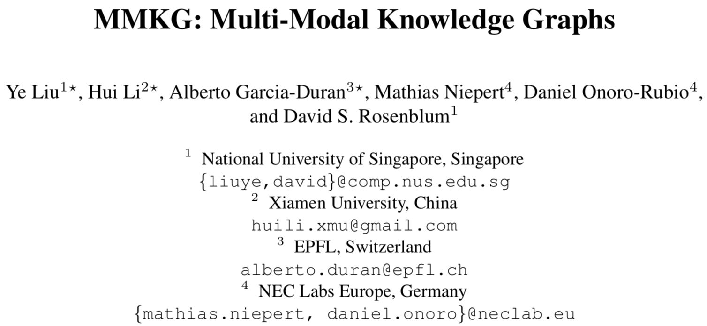
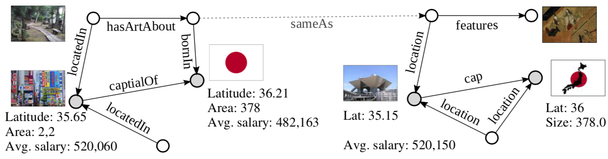
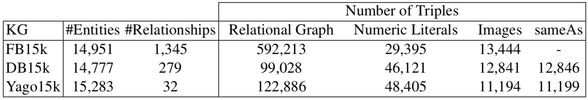
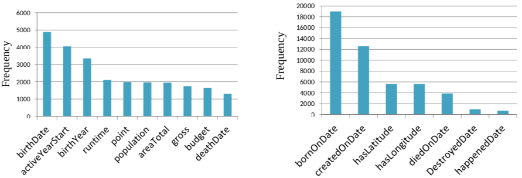
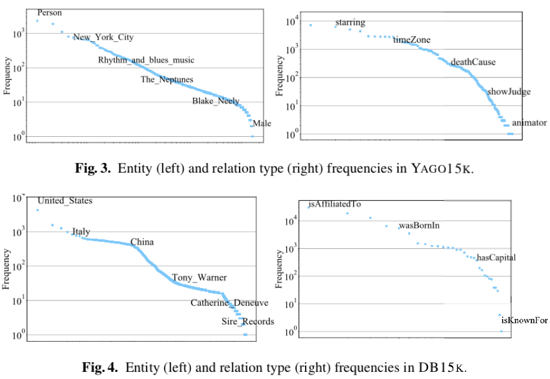

# 4.1

[TOC]

## 介绍

### 贡献

*   根据FREEBASE15K构造了两个全新的知识图谱：DBPEDIA15K and YAGO15K
*   知识图谱中的所有实体都添加了数值属性和图像信息
*   知识图谱之间添加了SAMEAS谓词。

## 技术

### 相关技术

#### 链接预测

*   为多关系链接预测提供了数据集
    *   在知识图谱中不仅包含了实体之间的多关系信息，还包括了数字和视觉信息。
    *   知识图谱之间存在异构性

#### 实例匹配

和现有的实例匹配数据集相比，MMKG有以下优点：

1.  MMKG中的实体包含了数字和视觉信息；

    *   可在实例匹配中加入数字和文本的信息

2.  很大比例的实体都有实体对齐的groud truth 信息；

    *   很好地验证方法的健壮性

    

### 构建技术

#### 构建DB15K

以现有的数据集Freebase-15K为蓝图，构建了DBPEDIA-15K和YAGO-15K。以构建DB15K的过程为例，具体的构建过程如下：

##### SAMEAS

*   找到FB15K和DBPEDIA的对应实体，来构建DB15K，利用SAMEAS进行连接。

##### RELATIONAL GRAPH

*   在上面一步中，FB15K的绝大多数实体都能在DBPEDIA中找到对应；
*   为了使FB15K和DB15K实体的**数目大致相同**，并且两者之间存在一些**无法对其的实体**，该方法对DB15K进行了扩充：
    *   在DBPEDIA中，选择和DB15K中现有的实体链接度最高的一些实体加入到DB15K中；
    *   将头实体与尾实体都存在与DB15K的三元组全部添加进来。

##### NUMERIC LITERALS

*   将实体中的所有数值属性都添加进来
    *   例如：/location/geocode/latitude

##### IMAGES

*   编写了Google Images, Bing Images, Yahoo Image Search 的爬虫
    *   为了减少噪音，利用FB15K中的Wikipedia URI来构建搜索query，减少一词多义的干扰；
    *   这样检索下来平均一个实例有55.8张图片；
    *   在这些图片中，为每个实例挑选两张符合清晰度、大小要求、不同的图片，分别分配给FB15K和DB15K。

#### 构建YAGO15K

*   上述的步骤重复一遍构建YAGO15K，除了一点不同：
    *   sameAs predicates from the YAGO dump align entities from that knowledge graph to DBPEDIA entities
    *   是和DBPEDIA对齐了的意思吧
*   可以发现并没有对YAGO15K和DB15K进行对齐，可见这两个知识库是通过DB15K连接起来的

#### 统计

不同的知识图谱之间存在异构性……其实我没看懂为什么，原因如下：

*   既然是以FB15K为蓝本，那么DB15K和YAGO15K的实体应该是非常相似的，为什么会呈现出图上的异构性？
*   然后，好吧，这对做实验影响不大

## 实验：知识图谱融合

#### 介绍

*   目标是链接不同知识图谱中的相同实体；

*   假设不同的模态在此任务中有补齐作用；
*   没有一对一的假设；

#### Products of Experts

*   将[POE方法](https://arxiv.org/abs/1709.04676)进行扩展，加入视觉信息；

##### PoE分布

*   通常，POE概率分布为，
    $$
    p\left(\mathbf{d} | \theta_{1}, \ldots, \theta_{n}\right)=\frac{\prod_{i} f_{i}\left(\mathbf{d} | \theta_{i}\right)}{\sum_{\mathbf{c}} \prod_{i} f_{i}\left(\mathbf{c} | \theta_{i}\right)}
    $$

    *   $\mathbf{d}$为离散空间中的数据向量；
    *   $\theta_{i}$是模型$f_{i}$的参数；
    *   $f_{i}\left(\mathbf{d} | \theta_{i}\right)$为$\mathbf{d}$在模型$f_i$中的值；
    *   $\mathbf{c}$是数据中间中所有可能的向量。

*   POE在训练过程中，分配观测到的三元组更高的可能性；为观测到的三元组更低的可能性。

？？？？