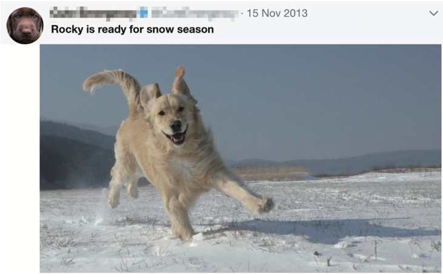
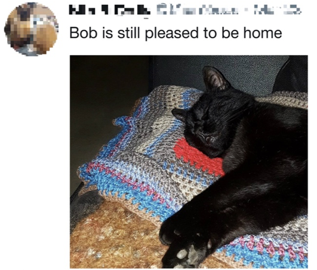
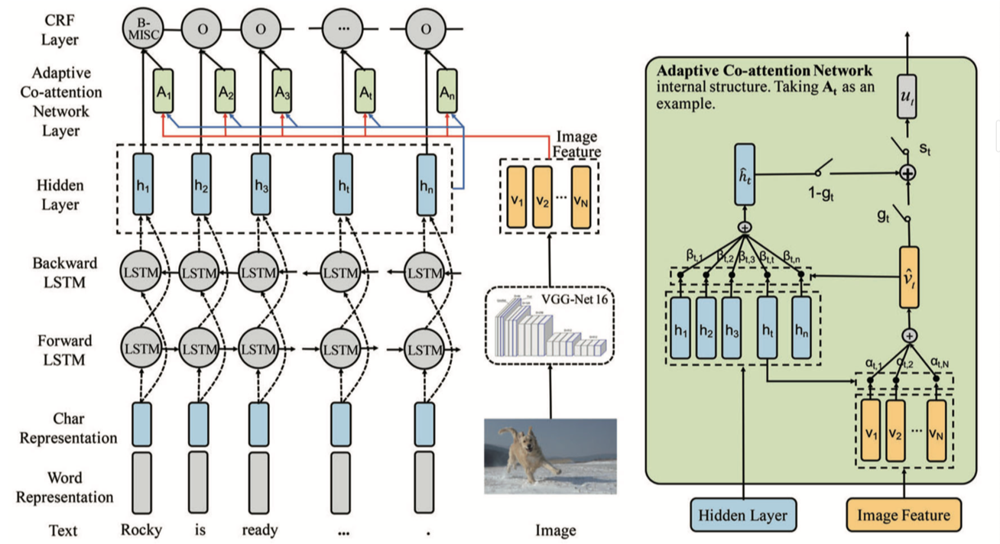
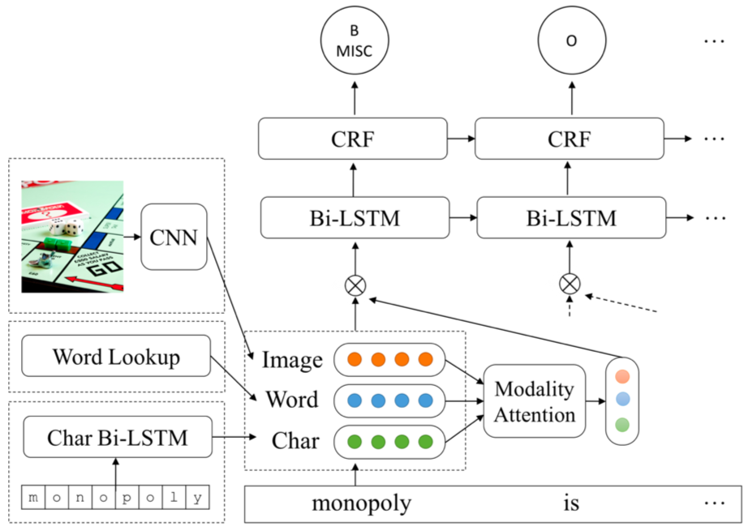
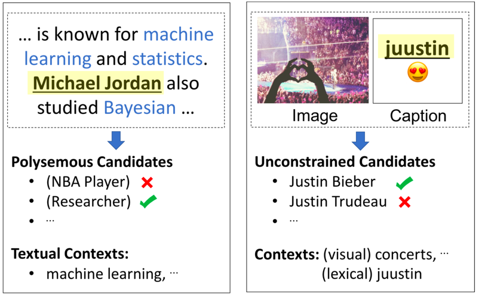

[TOC]

你把（1）多模态的实体识别、实体链接；（2）李飞飞她们的图像语义理解；（3）我们想做的多模态的关系抽取等。在你以前的这些PPT基础上整理一下发给我。

我晚上在四牌楼有一个会，正好里面有做图像的大牛，我想晚上找他们请教一下我们的这个点具体怎么做的思路。

---

# 1. 多模态命名实体识别
## 1.1 背景
* 命名实体识别指识别文本中具有特定意义的实体，它是NLP领域中的一个重要任务。传统的解决方案只利用了文本特征。
    * 基于纯文本的实体识别方法很难识别出下面推文中的实体类别。
        
        rocky是一条狗🐩🐶

        ---
        
        
    Bob是一只猫🐈🐱

    ---

## 1.2 目前方案
### 1.2.1 Adaptive Co-attention Network
#### 方案
传统实体识别框架Bi-LSTM(图中灰蓝)中引入图像特征(图中黄绿)，以解决多模态环境下的识别任务。
    

>Zhang Q, Fu J, Liu X, et al. Adaptive co-attention network for named entity recognition in tweets[C]//Thirty-Second AAAI Conference on Artificial Intelligence. 2018.

#### 细节
1. 遵从了目前的BiLSTM-CRF的序列标注NER形式：
    * 加入char representation解决拼写、缩略、大写的问题；
    * 利用注意力机制来确定与时间步t相关的文本和图像；

2. 抽取了图像的特征
    * VGG-Net，图像识别和分类算法，识别出图像中的实体**类型**。

3. 注意力机制
    * 在时间步t下，对于文本中的关键部分抽取，对于图像中的相关部分抽取。
    * **文本指导下的视觉注意力机制**：
        * 在时间步t，提取与t时刻最相关的图像区域特征$\hat{v}_ t$，
        * 整张图片与$t$下的文本特征计算注意力
    * **图像指导下的文本注意力机制** ：
        * 在时间步$t$，提取和当前词最相关的其他词。
    
### 1.2.2 

* 同样使用“BiLSTM+CRF+图像特征”的框架进行多模态实体识别，图像与文本特征融合的位置与前一种方法稍有不同。
    
    
    >Moon S, Neves L, Carvalho V. Multimodal named entity recognition for short social media posts[J]. arXiv preprint arXiv:1802.07862, 2018.

## 1.3 思考
1. 这几篇文章选取的场景都是推特，推文的特点如下
    * 长度的限制使其**文本上下文**内容较少，可能会导致很大的歧义；
    
    * 一般说来，推特中附加的**多模态信息**如图片、位置等等，都与文本密切相关；
    
    * 不规范**的文本，包含了很多网络流行语、错别字、emoji等等。

    这些特点导致了推特文本理解的困难，特别是在该领域，**实体识别**的效果还不能让人满意。
    
2. 图片特征探讨

   
---

# 2. 多模态实体链接、消岐
## 2.1 背景
* 命名实体链接，指将文本中识别出来的命名实体链接到知识库的对应实体上；

* 传统的实体链接方法如下图左，只利用实体的上下文信息；

* 多模态链接方法中(下图右)，利用图像信息来弥补文本上下文信息的缺失。
  

  

## 2.2 方案
* 传统的实体链接框架中，一般将词、字符特征联合映射到知识库的表示空间中，再进行相似度匹配；
* 多模态实体链接框架引入了图像的CNN特征，将其与词、字符特征一同映射到知识库表示空间中进行相似度匹配。

>Moon S, Neves L, Carvalho V. Multimodal Named Entity Disambiguation for Noisy Social Media Posts[C]//Proceedings of the 56th Annual Meeting of the Association for Computational Linguistics (Volume 1: Long Papers). 2018: 2000-2008.

---

# 引入文本特征的图像识别
---

# 引入文本特征的图像关系侦测
---

# 多模态数据集
## Visual Genome
* 由斯坦福大学人工智能实验室手工构建的多模态知识库。其设计初衷是将计算机视觉的研究从感知任务推向认知任务。对于每张图像，Visual Genome 都包含了充分地语义信息:
    > 区域描述信息
    > 图片中的对象
    > 对象的属性
    > 对象之间的关系
    > 区域图
    > 场景图
    > 问答对

