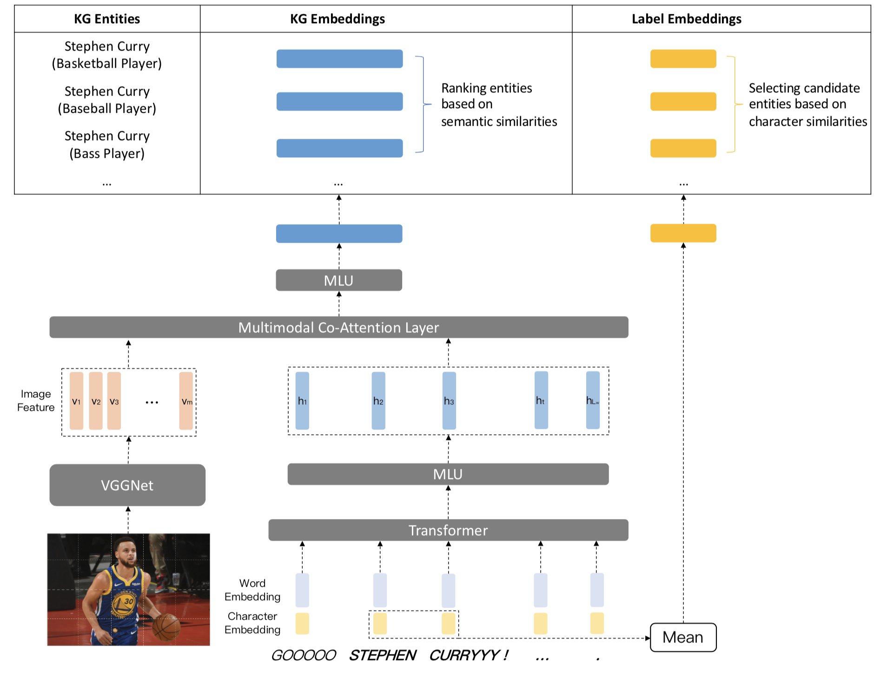

# 多模态命名实体链接

>   献给觉醒的你。

[TOC]

## 多模态命名实体识别

### 任务

社交网络下的多模态命名实体链接，任务是在社交网络中的多模态推文中，找到可链接指称并其链接到知识图谱的对应实例上。

### 标记

定义$\mathbf{X}=\{\mathbf{x}^i\}_{i=1}^N$为输入的$N$个多模态帖子，每个$\mathbf{x}^i$中包含的可链接指称集合为$ \mathbf{M}_i=\{\mathbf{m}^i_j\}_{j=1}^{K_i}$，$K_i$代表了第$i$个帖子中可链接指称的数量；与输入对应的真实输出为$\mathbf{Y}=\{\mathbf{y}^i\}_{i=1}^N$，输出的每一项都对应了一个知识库的实体列表$\mathbf{y}_i=\{\mathbf{y}_j^i\}_{j=1}^{K_i}$，其中$\mathbf{y}_j^i\in\mathbf{KG }$表示$\mathbf{m}^i_j$对应到知识图谱中的实体。

每个输入样本中都包含了三个模态的信息：$\mathbf{x}=\{\mathbf{c},\mathbf{w},\mathbf{v}\}$，其中，$\mathbf{c}=\{\mathbf{c}_{t}\}_{t=1}^{L_c}$代表了帖子文本中每个单词的字符序列，$L_c$代表了字符序列的长度；$\mathbf{w}=\{\mathbf{w}_{t}\}_{t=1}^{L_w}$代表了帖子文本包含的单词内容，其中$L_w$代表了帖子中单词的个数；$\mathbf{v}$代表了帖子附带的图片。本文将从这三种信息中抽取的特征分别表示为字符嵌入$ \mathbf{f_c}$，词嵌入特征$\mathbf{f_ w}$与图像特征$\mathbf{f_v}$。

每个真实输出中，包含了两个模态的信息：$\mathbf{y}=\{\mathbf{y}_c,\mathbf{y}_\text{KB}\}$，其中$\mathbf{y}_c$代表了知识图谱中实体标签的字符信息，$\mathbf{y}_\text{KB}$代表了知识图谱中和实体有关的三元组信息。同样，本文将从这两种信息中抽取特征分别表示为字符嵌入特征$\mathbf{f}_c(\mathbf{y}_c)$与知识图谱嵌入特征$\mathbf{e}(\mathbf{y}_\text{KG})$。

这样，本文将实体链接任务形式化为下面的等式：
$$
\mathbf{y}=
\underset{\mathbf{\hat{y}}\in\mathbf{KG}}
{\arg\max}\operatorname{sim}(\operatorname{f}_{\mathbf{m\rightarrow{y}}}(\mathbf{x},\mathbf{m}),\mathbf{\hat{y}}),
$$
其中，$\operatorname{f}_{\mathbf{m\rightarrow{y}}}$是将输入帖子中的可链接指称映射到知识图谱实体嵌入空间的函数，其中的参数将通过训练获得。$\operatorname{sim}$函数将计算预测的实体和知识图谱真实实体之间的相似程度。

### 特点

与传统的命名实体链接任务不同的是，多模态NED有以下特点：

*   实体名称和知识图谱中的实例名称有不对应的现象，比如："STEEEEEEEEEPHEEEEEEN CURRRRRRY"与"Stephen Curry"；
*   由于字数限制，帖子长度较短，上下文信息较少；
*   帖子中包含有图片，图片一般和文本有着较强的关联。

### 挑战

要解决社交网络下的命名实体链接，就要考虑以下问题：

1.  不规则文本的问题 (OOV)：在社交网络环境下，存在着许多不规则的文本，这些文本表示的实体不能直接链接到知识图谱上；
2.  上下文缺失的问题：在社交帖子中，上下文的情况下，需要用其他模态的信息如图片来作为补充的上下文；
3.  多模态表示的问题：一张图片包含的信息很多，直接利用图片内容作为上下文肯定有许多噪音。而在社交帖子中，图片和文本的内容强相关，需要找到合适的联合方法来挖掘这两者之间的关联。
4.  知识图谱表示的问题：挑选合适的方法获得知识图谱表示。
5.  相似性计算的问题：构建相似度计算的方法，从知识图谱中找到与指称最相关的前K个实体。

## 模型

### 介绍

本文提出的多模态实体链接模型如图所示。模型共由三部分组成：特征抽取、候选实体库构建与实体链接。其中，特征抽取阶段将分为字符、文本与图像特征抽取以及这三个模态特征融合；候选实体库构建主要考虑如何利用文本中的实体指称找到知识图谱中的关联实体；实体链接部分考虑利用文本和知识图谱的语义信息，将指称链接到知识库中的对应实体。接下来的内容将介绍这三部分的实现细节。

### 特征提取

近期，非线性的深度神经网络，在实体链接方法取得了成功。和传统的手工构造特征相比，神经网络能够端到端地进行训练，从原始数据中直接发现特征。从现有任务的结果来看，数据驱动的特征提取能够自动地从无监督的大规模文本语料中学习文本特征。但是，其仍然存在一些问题，比它无法处理不不在训练集或者在训练时出现次数很少的词，这些问题为现有的实体链接模型带来了效果上的损失。

社交帖子中下下文语义缺失的问题，为实体链接任务带来了新的挑战。如果只依赖文本特征，那么帖子中大量存在的图像信息就不能被利用。在这种情况下，需要尝试将将图像的信息也考虑进来。

本章将介绍本工作特征抽取的方案，包括字符特征抽取、词级特征提取、图像特征提取以及多模态融合。

#### 字符特征抽取

目前主流的文本特征抽取法，都是从大规模无监督文本中训练得到。对于训练集中频繁出现的词，现有的词嵌入方法能够有较好的表现。对于训练集中很少货没有出现过的稀有词，现有的词嵌入法一般利用随机初始化进行处理。 社交帖子中的文本具有不规范性，用户输入的许多都是不标准的单词。以往的词嵌入方法很难在社交帖子中达到在处理通用领域文本中的表现。

在"Text Understanding from Scratch"等人的工作中，提出字符嵌入的概念。他们将一个单词的看作字符的序列，然后利用CNN对这个序列进行特征提取。在实验中，他们发现字符嵌入的加入能够提高模型在不规范文本上的效果。在后来的许多工作中，字符嵌入被证明能够提取单词的形态学特征，解决了字符不对应文本的匹配问题。在后来的研究当中，更多的方法如RNN也被用来提取字符的特征，并证明了字符嵌入不受语义的影响， 能够很好地适配实体链接任务。

本文将利用字符嵌入来解决社交帖子中不规范文本的问题。对于一个单词$\mathbf{w}$，将其拆分为字符的序列$ \mathbf{C}=\{\mathbf{ch}_t\}_{t=1}^{L_c}$，在查表获得每个字符的初始特征之后，利用双向LSTM对该字符序列进行特征识别。具体地，在时间步$t$，LSTM的更新公式如下：
$$
\begin{aligned} \mathbf{i}_{t} &=\sigma\left(\boldsymbol{W}_{i} \left[\mathbf{h}_{t-1};\mathbf{x}_{t}\right]\right), \\ \mathbf{f}_{t} &=\sigma\left(\boldsymbol{W}_{f}\left[ \mathbf{h}_{t-1}; \mathbf{x}_{t}\right]\right), \\ \tilde{\mathbf{c}}_{t} &=\tanh \left(\boldsymbol{W}_{c-1} \left[\mathbf{h}_{t-1};\mathbf{x}_{t}\right]\right), \\ \mathbf{c}_{t} &=\mathbf{f}_{t} \odot \mathbf{c}_{t-1}+\mathbf{i}_{t} \odot \tilde{\mathbf{c}}_{t}, \\ \mathbf{o}_{t} &=\sigma\left(\boldsymbol{W}_{o} \left[\mathbf{h}_{t-1}; \mathbf{x}_{t}\right]\right), \\ \mathbf{h}_{t} &=\mathbf{o}_{t} \odot \tanh \left(\mathbf{c}_{t}\right), \end{aligned}
$$

其中，$\sigma$是逐元素进行sigmoid函数变换，$\odot$为逐元素乘积，$\mathbf{x}_{t}$为$t$时刻的输入向量，$\mathbf{h}_{t}$是$t$时刻的隐层输出，$\boldsymbol{W}_{i}$$ \boldsymbol{W}_{f}, \boldsymbol{W}_{c}, \boldsymbol{W}_{o}$为可学习的权重，上面的公式隐藏了偏置值。

上面的公式只包含了单向LSTM的更新，其只能接受过去的信号，但是未来序列的信息对当前时间步也是有帮助的，所以本文增加了一个从结束字符到开始字符的LSTM进行特征抽取。对于每个字符$\mathbf{ch}_t$，我们将学习到两个表示$\overrightarrow{h_{c,t}}$和$\overleftarrow {h_{c,t}}$，所以在时间步$t$，最终得到的字符嵌入$h_t $为：
$$
h_{c,t}=\operatorname{Concat}\left( \overrightarrow{h_{c,t}}, \overleftarrow {h_{c,t}}\right) , h_{c,t}\in \mathbb{R}^{d_c}
$$
其中，$d_c$代表字符嵌入的维度。

#### 文本特征抽取

从近期自然语言处理方向的工作来看，端到端的模型逐渐替代了手工构建特征的方法。文本特征抽取的目的是从文本中抽取合适的特征来完成任务，其效果对NLP模型最终表现的影响十分可观。本文将利用BERT初始化词向量并利用Transformer对字符、词级别特征进行联合抽取。

本文通过预训练的BERT初始化词向量，并且在后续的训练中对BERT模型进行微调。在许多NLP任务中，使用BERT+Finetuning框架达到了最好的效果。利用BERT，我们将一个帖子的自然语言文本$\mathbf{W}=\{\mathbf{w}_1,\mathbf{w}_2,...,\mathbf{w}_N\}$表示为特征矩阵:
$$
\mathbf{B}=\operatorname{BERT}(\mathbf{w}), \mathbf{B}\in \mathbb{R}^{d_w\times {L_w}}
$$
其中，$\mathbf{B}=\{h_{w,1},h_{w,2},…h_{w,Lw} \}$是利用BERT从$\mathbf{W}$中抽取的文本特征矩阵，$h_{w,t}$为单词$\mathbf{w}_i$的特征向量且$h_{w,t}\in\mathbb{R}^{d_w}$。

考虑到社交帖子中许多不规范文本没有出现在BERT的预训练预料中，BERT预训练在这些词上无法达到很好的效果。所以，本文将结合文本特征与字符特征进行串联：
$$
\begin{aligned}
s_t&=\operatorname{Concat}(h_{w,t},h_{c,t})\\
\mathbf{S}&=\{s_{t}\}^{L_w}_{t=1},
\end{aligned}
$$
其中，$d$代表了文本向量的维度。

Transformer Encoder是由Google提出的文本特征抽取器，其能够利用Self-Attention捕捉一段文本上下文的语义信息。一个Transformer Encoder由若干个结构相同但是参数不同Transformer块堆叠而成，每个Transformer块中，包括了自注意力（Self-Attention）、多头注意力(Multi-Head Attention)、全链接前馈网络(Feed-Forward Networks)等组件。具体地，我们将一个句子的文本表示矩阵$\mathbf{S}$输入到最底层的Transformer块中，自注意力和多头注意力的计算公式如下：
$$
\begin{aligned}
\left[ \begin{array}{c}
\mathbf{Q}_i\\
\mathbf{K}_i\\
\mathbf{V}_i
\end{array}\right]
&=\mathbf{S}^T 
\left[ \begin{array}{c}{W^Q_i} \\ W^K_i\\ W^V_i\end{array}\right]

\\

\text{head}_i&=\operatorname{softmax}(\frac{\mathbf{Q}_i\mathbf{K}_i^T}{\sqrt{d_k}})\mathbf{V}_i,\\
\text{MultiHead}&=\operatorname{Concat}(\text{head}_1,\text{head}_2,...,\text{head}_h)W^O,

\end{aligned}
$$

其中，$i\in[1,h]$，$h$代表多头注意力中头的个数，$W^Q_i, W^K_i,W^V_i\in\mathbb{R}^{d\times d_k}$为计算第$i$个头的参数矩阵，$W^O\in\mathbb{R}^{hd_k \times d}$代表多头注意力的参数矩阵。$\text{Multihead}\in\mathbb{R}^{L_w \times d}$代表了多头自注意力的计算结果，其第$t$行的向量$h_{m,t}$代表了$s_t$对应的特征值。接着，将$h_{m,t} $输入到全连接前馈网络中，该网络包含了利用ReLU激活函数连接的两个线性变换：
$$
h_t=max(h_{m,t},h_{m,t}W_1+b_1)W_2+b_2,
$$
其中，$h_t$为单词$s_t$经过Transformer块变换的特征，$W_1,W_2$为前馈神经网络的参数矩阵，$b_1,b_2$为偏置。

由于上述Transformer块中并没有考虑文本序列的位置信息，在实际操作中，需要在最底层Transformer输入的特征向量中，对每个不同的位置$t$加入位置嵌入(Position Embedding)：
$$
\begin{aligned}
P E_{(t, 2 i)}=\sin \left(t/ 10000^{2 i / d}\right),\\
P E_{(t, 2 i+1)}=\cos \left(t / 10000^{2 i / d}\right),
\end{aligned}
$$
其中，$i$代表了特征的维度。

将文本特征矩阵$S$多个Transformer块的堆叠成的Transformer中，将转化为蕴含高阶特征的文本向量：$\mathbf{f_w}=\{h_t\}_{t=1}^{L_w},h_t\in\mathbb{R}^d$。

####  图像特征抽取

在实体链接任务中，通常假设指称所在的句子中有充足的上下文信息来帮助消岐。但是在社交网络短文本当中，很多帖子没有上下文文本信息，但是会有附加的图像、音频、视频、地理位置等多模态信息，这些信息通常与帖子中的文本紧密相关。因此，本文将图像信息作为上下文来辅助实体链接任务。

本文将利用16层的VGGNet对图像的特征进行特征提取，参照"FUdan"的工作，本文选取最后池化层输出的特征来抽取不同区域的空间特征。先将图片大小重塑为$224\times 224$像素，再从VGGNet的最后的池化层中提取特征$\tilde{v}=\{\tilde{v}_1,\tilde{v}_2,...,\tilde{v}_m\}, \tilde{v}_i\in\mathbb{R}^{d_v} $，其中，$m$为划分区域的数量，$d_v$为每一个图像区域特征的维度。同样，为了计算的便利，利用一个非线性变换将图像的特征映射到文本特征空间中：
$$
\mathbf{f_v}=\tanh(W_I\tilde{v}+b_I),
$$
其中，$\mathbf{f_v}=\{v_t\}_{t=1}^{L_v},v_t\in \mathbb{R}^d$。

#### 多模态融合模块

由于文本和图像的异构性，需要设计方法将两者的特征进行融合。在许多工作中，直接将不同模态的特征进行串联构成多模态特征，但是经验表明，这样融合的特征很难捕捉到模态之间相互关联的信息。而且，在实体链接任务中，只需要关注图像中某些区域的特征而不是全局特征，将图像中所有的特征添加进最终的向量表示，会导致噪音过多而导致模型的效果下降。

在本工作中，将利用互注意力机制对文本-视觉的特征进行融合。此前，互注意力机制被证明在VQA、多模态实体识别等任务上有着出色的表现。互注意力的主要思想是：先利用文本特征$\mathbf{f_w }$来确定图像中与文本最相关的区域，过滤图像无关区域产生的噪音，形成新的图像特征表示$\mathbf{\tilde{v} }$；然后，利用新生成的图像表示$\mathbf{\tilde{v}}$来确定文本中与图像最相关的文本特征$\mathbf{\tilde{w}}$。

我们定义注意力操作$\operatorname{CoAtt(\boldsymbol{X},\boldsymbol{g} )}$如下：
$$
\begin{aligned} \boldsymbol{H} &=\tanh \left(W_{x} \boldsymbol{X}+\left(W_{g} \boldsymbol{g}\right) \boldsymbol{1}^{T}\right), \\ \boldsymbol{a}^{x} &=\operatorname{softmax}\left(W_{h x}^{T} \boldsymbol{H}\right), \\ \hat{\boldsymbol{x}} &=\sum a_{i}^{x} \boldsymbol{x}_{i}, \end{aligned}
$$
其中$W_{x}, W_{g} \in \mathbb{R}^{k \times d} \text , W_{hx} \in \mathbb{R}^{k}$均为参数矩阵(不同的调用中参数)，$\boldsymbol{1 }\in \mathbb{R}^N$为元素值都为1的向量。

计算互注意力需要调用三次$\operatorname{CoAtt(\boldsymbol{X},\boldsymbol{g} )}$：
$$
\begin{aligned}
\mathbf{\tilde{w}}^{\prime}&=\operatorname{CoAtt^1}(\mathbf{f_w},\mathbf{\overrightarrow{0}}),\\
\mathbf{\tilde{v}}&=\operatorname{CoAtt^2}(\mathbf{f_v},\mathbf{\tilde{w}^{\prime}}),\\
\mathbf{\tilde{w}}&=\operatorname{CoAtt^3}(\mathbf{f_w},\mathbf{\tilde{v}}),
\end{aligned}
$$
第一次调用中，文本特征矩被映射到了$d$维的特征空间中，形成$\mathbf{\tilde{w}}^{\prime}\in \mathbb{R}^d$；第二次调用中，利用文本特征向量$\mathbf{\tilde{w}}^{\prime}$与图像特征求得注意力权重，再求出所有注意力权重和图像特征向量的带权和，得到基于文本的图像表示$\mathbf{\tilde{v}}\in \mathbb{R}^d$；第三次调用，利用$\mathbf{\tilde{v}}$求得基于图像的文本向量$\mathbf{\tilde{w}}\in \mathbb{R}^d$。

在社交帖子中，文本和图片在不同场景下的重要性不同。为了融合$\mathbf{\tilde{v}}$与$\mathbf{\tilde{w}}$，需要计算一个多模态门控单元$\mathbf{g }$来控制两者在最终表示的占比：
$$
\mathbf{g}=\sigma(W_{gate}[\mathbf{\tilde{v}};\mathbf{\tilde{w}}]),
$$
其中，$W_{gate}\in\mathbb{R}^{2d}$为参数矩阵，$\mathbf{g}$为门控单元。最终，一个多模态社交帖子可表示为：
$$
\mathbf{p}=\mathbf{g}\odot\mathbf{\tilde{v}}+(1-\mathbf{g})\odot\mathbf{\tilde{v}}
$$
其中，$\mathbf{p}$包含了字符、文本与图像三个模态的信息。

### 候选实体库构建

对指称$\mathbf{m}$进行链接前，需要构建它的候选实体库，候选实体库包含了最有可能与$\mathbf{m}$匹配的$k$个知识图谱实体。传统的NED任务假设指称能够完全匹配知识库中的实体名：在识别出句子中的指称之后，直接从知识库中寻找同名实体构成候选实体库，然后从候选实体库中选择链接可能性最大的实体作为指称的链接实体。但是，真实的情况往往不符合这种假设：知识图谱在实体别名上具有不完备性，简单利用字符串匹配方法无法将指称链接到知识图谱的某个词条上。在社交网络帖子中，可能出现的情况如下：

1.  指称中的某个字母被重复输入多次："Stephen Curry"与"STEEEEEEEEEPHEEEEEEN CURRRRRRY"；
2.  指称中删除了某些字符，如："Curry"与"Cury"；
3.  指称中某些单词的顺序被替换："Stephen"与"Stephne"；

在"字符特征抽取"一节中提到，将文本转化为对应的字符嵌入能够提取字符的形态学特征，能够解决字符不对应文本的匹配问题。如图所示，在构建候选实体库前，模型先将句子中的实体指称和知识图谱中的实体名称分别转化为字符嵌入向量，然后利用向量的相似度匹配来选择与实体指称最相似的$k$个实体加入到候选实体库当中。

知识图谱包含了大量实体(YAGO中包含了超过1000万个实体、谷歌知识图谱则超过5亿七千万)，直接进行指称和实体名比较效率会非常低。为了高效构建候选实体库，本文借鉴KNN的思想，利用k-d树来降低查询复杂度，其步骤如下：

1.  将知识图谱中的所有实体的名称转化为字符向量；

2.  根据所有的实体名字符向量构建一颗k-d树$\mathbf{T_{kd}}$；

3.  给定一个指称$\mathbf{m }$，将其转化为字符向量$\mathbf{f_c}(\mathbf{m})$;

4.  在$\mathbf{T_{kd}}$中查询与$\mathbf{f_c}(\mathbf{m})$最相似的$k$个向量；

5.  将$k$个向量对应的实体添加到$\mathbf{m}$的候选实体库中：
    $$
    \mathbf{Candidate\_Set}(\mathbf{m})=\{\mathbf{\hat{y}}_i\}_{i=1}^k, \mathbf{\hat{y}}_i\in\mathbf{KG}.
    $$
    

### 实体链接

将实体指称$\mathbf{m}$的候选实体库构建完成后，将执行实体链接的操作。实体链接需要将$\mathbf{m}$链接到对应的知识图谱实体上。其主要思想是利用指称的上下文信息与候选实体库中实体的上下文信息进行语义相似度比较，选择与指称上下文最匹配的实体作为最终的链接实体。

目前，知识图谱主要由文本信息构成，很少包含其他多模态信息。所以在抽取知识图谱实体特征时，只考虑文本与字符模态的信息：先将知识图谱实体$\mathbf{\hat{y}}$的三元组拼接成文本的形式，形成实体的描述文本；接着利用模型中的文本特征抽取方法对实体描述文本进行特征抽取，得到特征向量$\mathbf{\hat{e}}\in\mathbb{R}^d$。

上文提到，由于$\mathbf{m}$文本上下文较短，包含的语义信息较少，本文将图片作为上下文信息加入到帖子的表示当中。最终一个多模态帖子$\mathbf{x}$被转化为一个多模态表示$\mathbf{p}\in\mathbb{R}^d$，其中包含了字符、文本和图片三个模态的信息。然后，模型将学习一个仿射变换将$\mathbf{p}$映射到$\mathbf{e}$的向量空间中：
$$
\mathbf{\hat{p}}=W_{pe}\mathbf{p}+b_{pe}
$$
其中，$W_{pe}\in\mathbb{R}^{d\times d}$为仿射变换矩阵，$b_{pe}$为偏置。

得到了指称上下文$\mathbf{p}$表示与候选实体库的实体表示集合$\mathbf{E}=\{\mathbf{\hat{e}}_i\}^k_{i=1}$之后，利用余弦相似度一一比较$\mathbf{p}$与$\mathbf{E}$中元素的相似性，相似度最高的实体即为$\mathbf{m}$对应的链接实体：
$$
\mathbf{y}=\underset{\mathbf{\hat{y}_i\in\mathbf{KG}
}}{\operatorname{argmax}}\operatorname{sim}(\mathbf{p}, \mathbf{\hat{e}}_i).
$$

