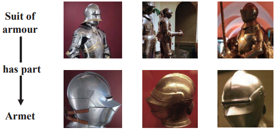
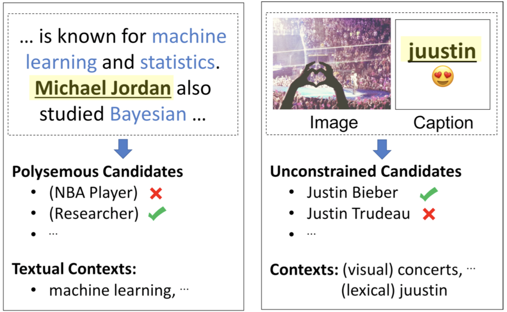
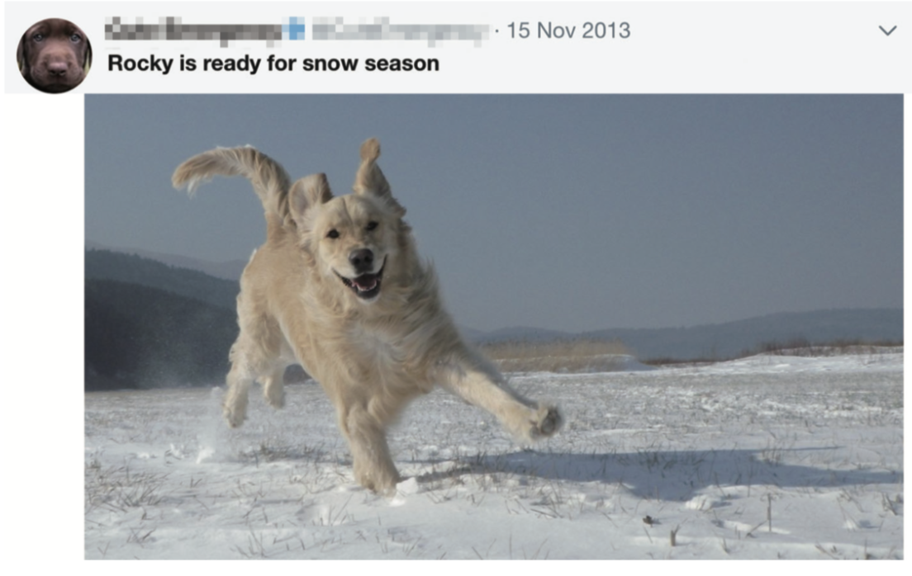

# #

[TOC]

# 1. 问题

## 1.1 研究点的疑问

在目前的CV领域，有很多任务中引入了文本的语义信息来提高识别任务的效果，如[Srivastava et al., 2012](http://papers.nips.cc/paper/4683-multimodal-learning-with-deep-boltzmann-machines.pdf)，[Frome et al., 2013](http://papers.nips.cc/paper/5204-devise-a-deep-visual-semantic-embedding-model.pdf)等等。但是反过来，NLP任务如命名实体识别、关系抽取、知识图谱表示等等，目前还没有许多工作将视觉信息加入来提升效果的。

我在下面分享了一些自己对这个问题的看法。请问一下各位大佬：**多模态和知识图谱(或其他NLP任务)有结合的价值吗？**

##1.2 科研上的疑问

本人目前研二，导师在研二开始时确定了多模态(视觉)+知识图谱方向。我阅读了许多相关论文，但是发现这个方向的可研究的点较少，或者在硕士期间很难用有限的时间将其研究透彻。

现在已经研二下学期过半，我仍然找不到合适的开题思路，目前的时间点又无法轻易地换题目，让我十分焦虑。如果可以的话，**希望大家能够在科研方法上提一些建议**，谢谢！

# 2. 思路

在这一年里，我考虑过一些研究方向，大多是想在知识图谱表示[Xie et al., 2017](https://arxiv.org/pdf/1609.07028.pdf)、实体识别[Zhang et al., 2018](https://pdfs.semanticscholar.org/5ca1/c595708d22d92b3f913be391575560bdab2c.pdf?_ga=2.258610882.953046097.1557891086-1745154373.1553132250)等工作上进行扩展，我的一些想法包括：

1.  多模态关系抽取

    利用图片的信息来辅助文本关系抽取。但是图片包含的大多是实体的概念信息，在关系抽取上的作用很小。

2.  多模态知识图谱表示

    基于[Xie et al., 2017](https://arxiv.org/pdf/1609.07028.pdf)的工作继续深入，这是一个好的点子。但是除了那篇论文提供的例子，好像没有太多真实的应用场景。

3.  多模态命名实体识别、实体链接

    基于[Zhang et al., 2018](https://pdfs.semanticscholar.org/5ca1/c595708d22d92b3f913be391575560bdab2c.pdf?_ga=2.258610882.953046097.1557891086-1745154373.1553132250)工作的扩展，应用场景局限在社交推文当中，达到要求的数据集很难收集。

导师给了我一些研究方向，比如：

1.  多模态知识图谱的构建

    将现有的知识图谱加入图像，这好像是一个工程问题……目前有一篇工作提供了多模态知识图谱：[Liu et al., 2019](https://arxiv.org/pdf/1903.05485.pdf)

2.  图像特征与知识图谱的联合表示

    就是多模态知识图谱表示，但是这方面[Xie et al., 2017](https://arxiv.org/pdf/1609.07028.pdf)的工作让我看到了这个研究点有很大的局限性。

# 3. 现状

## 3.1 视觉信息辅助NLP任务

目前，现有的知识图谱主要由文本构成，其他类型的信息一般会用url链接的形式存储。

很少有知识图谱的相关研究中，涉及到其他模态的信息。据我了解，当下对的多模态+知识图谱的研究有以下的一些工作：

### 3.1.1表示学习

谢若冰的在IJCAI17发表的工作[Xie et al., 2017](https://arxiv.org/pdf/1609.07028.pdf)。他为现有知识图谱中的实体添加相应的图片，并利用利用类TranE的思想在新构建的图像-文本知识图谱上作表示学习。如图1所示，该工作将图片中的包含关系或是视觉上的相似关系加入到知识图谱表示当中。思路相仿的论文还有[Sergieh et al., 2018](https://pdfs.semanticscholar.org/be91/946bedbf65d543a7eb9dd1e033e7aaf78c3c.pdf?_ga=2.239204043.953046097.1557891086-1745154373.1553132250)，[Pezeshkpour et al., 2018 ](https://aclweb.org/anthology/D18-1359)。

### 3.1.2 命名实体链接

CMU在ACL18发表的[Moon et al., 2018a](https://vitordecarvalho.github.io/papers/acl2018_NED.pdf)，在推特带有图片的推文上作实体链接。如图2所示，该工作的思路是利用图像中包含的视觉上下文信息来帮助实体消岐。在推文中，由于文本上下文的缺失，无法用传统的方法来对当前实体消岐，而替代地利用图像中的实体作为上下文。

### 3.1.3 命名实体识别

命名实体识别是从原始文本中构建知识图谱的前置任务，所以将其放在这里。

CMU在NAACL18上的[Moon et al., 2018b](https://www.aclweb.org/anthology/N18-1078)和复旦大学在AAAI18上发表的[Zhang et al., 2018](https://pdfs.semanticscholar.org/5ca1/c595708d22d92b3f913be391575560bdab2c.pdf?_ga=2.258610882.953046097.1557891086-1745154373.1553132250)都实现了推特中的带有图片推文的命名实体识别。利用图片附加的信息，我们可以判断文本中一些实体的类型。图3放上Zhang et al., 2018中的一个生动又典型的例子：如果没有图像的帮助，文本中的"Rocky"就会被识别为人名。

## 3.2 文本语义信息辅助CV任务

实际上，目前多模态领域更多的是用文本的语义信息来辅助CV领域的任务，如图像识别([Srivastava et al., 2012](http://papers.nips.cc/paper/4683-multimodal-learning-with-deep-boltzmann-machines.pdf)，[Frome et al., 2013)](http://papers.nips.cc/paper/5204-devise-a-deep-visual-semantic-embedding-model.pdf)、图像关系侦测(relation detection)([Lu et al., 2016](https://link.springer.com/content/pdf/10.1007%2F978-3-319-46448-0.pdf))、零样本迁移学习([Socher et al., 2013](http://papers.nips.cc/paper/5027-zero-shot-learning-through-cross-modal-transfer.pdf))、VQA([Lu et al., 2016](https://arxiv.org/pdf/1606.00061.pdf))等等。在这些任务中，这些词嵌入包含的语义信息对CV的识别有提升作用。

# 4. 难点

就此，我归纳的一下原因以及多模态+知识图谱的任务难点如下：

1.  以目前的研究水平来看，其他模态如视觉信息，能够提供的信息非常有限

    上面介绍了一些用视觉辅助NLP任务的例子，然而目前CV领域的研究还停留在偏"感知"的分类、识别上，提供的信息也只有图片实体类型信息、属性信息、位置信息等等，这些对NLP中的偏"认知"任务的帮助是很小的。

    *   在[Xie et al., 2017](https://arxiv.org/pdf/1609.07028.pdf)中，定义的实体之间的"关系"是很有限的，只有"has part", "part of", "synset domain topic of"等等简单的关系；
    *   [Moon et al., 2018a](https://vitordecarvalho.github.io/papers/acl2018_NED.pdf)和[Moon et al., 2018b](https://www.aclweb.org/anthology/N18-1078)中，直接先将图片中的实体识别出来，再利用实体的类型信息辅助具体任务。

2.  视觉信息的识别仅限于概念信息，而非实例信息

    我们知道，知识图谱"重实例，轻本体"，在文本中，我们将一个实体识别出来之后，利用一些字符串匹配方法，很容易地就可以将该实体链接到知识图谱的一条实例上去。而从图片中，我们只能识别出实体的概念。

    >   
    >
    >   "<u>特朗普</u>当选了美国总统。"

    在图4的一条多模态信息中，我们很容易地将识别出的文本实体"特朗普"链接到知识图谱上。而利用图像识别，我们只能识别出概念"人"。

3.  目前的研究点还比较狭隘，很难继续深入

    这一点和第1点很相似，受CV现阶段的研究水平所限，基于视觉信息的NLP任务无法有很大的突破。而且，现阶段相关任务的**数据集**还很少，无法支持这方面的研究。

某些研究难点，直接让我放弃考虑了"多模态关系抽取"这种思路，目前视觉信息辅助NLP任务的工作还很少。

# 5. 总结

感谢大家能看到这里，上面的内容都是我的一些浅显的看法，如果有不对的地方，欢迎大家指正。**希望大家能对我的问题给出看法，也希望正在研究这个领域的小伙伴们与我交流**， 谢谢！

