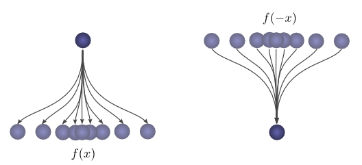
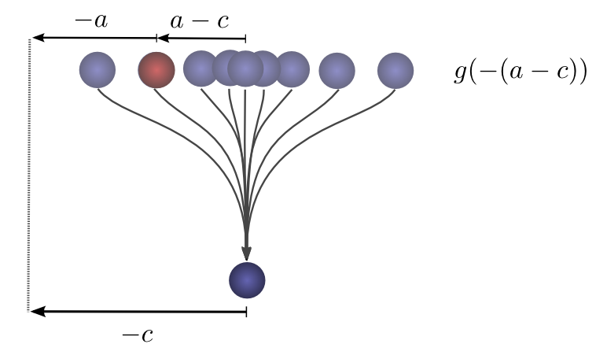
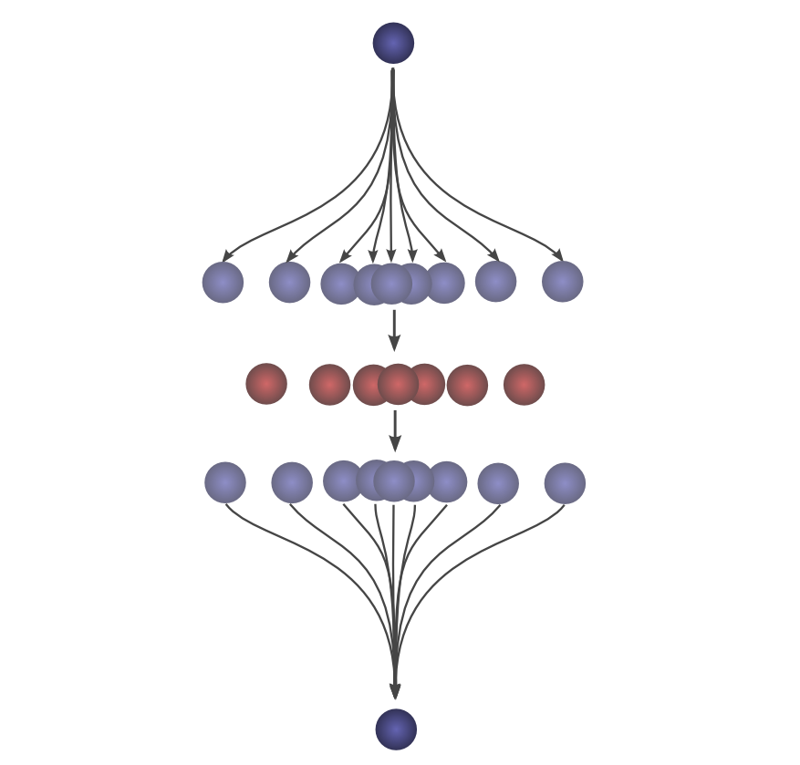
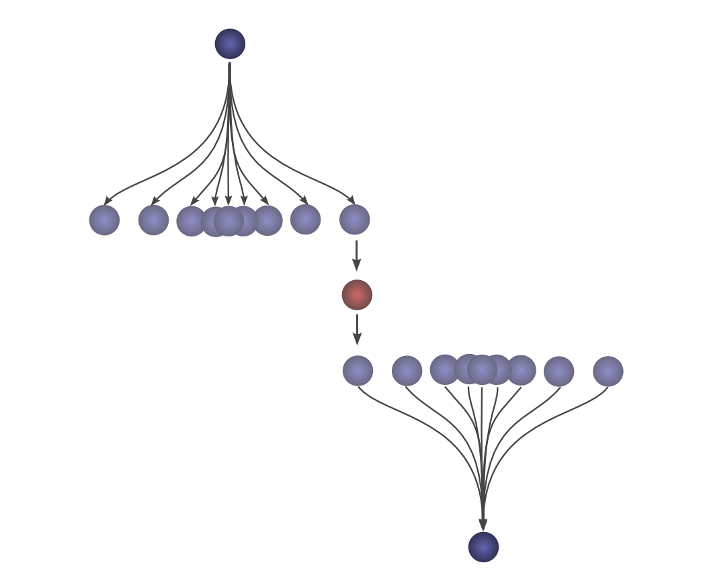

# 1

>   献给要卷积的自己。

## 卷积可视化

1.  在一个抛球观测中，假设抛出的小球从初始点$0$降落到点$x$处的概率为$f(x)$；

2.  然后，将降落的位置看作为$0$，则初始点的位置为$-x$（坐标系的刻度发生相对位移，但是位置没有改变）。则可以认为，从当前位置出发，返回初始点的概率为$f(-x)$

    

3.  如果已知在第二次抛出后，小球在距初始点$c$的位置着陆，那么有多少的概率小球第一次着陆的距离距初始点为$a$？

    *   第二次抛出后，我们再次调整坐标系的刻度。现在，初始点的位置为$-c$，当前点的位置为$0$，第一次着陆点的位置为$-a$，第二次抛球走过的距离为$a-c$；

    *   第二次抛球的概率表示为$g$，则从当前位置回到第二次抛球的位置的概率为：
        $$
        g(-(a-c))=g(c-a)
        $$
        

    

4.  所有的中间位置都会影响到最终的距离$c$。我们知道了从初始点抛球到点$a$的概率为$f(a)$，还知道了在第二次抛球后，着陆点与初始点的距离为$c$的条件下，第一次抛球到点$a$的概率为$g(c-a)$。
5.  对所有$a$产生的概率相加，就得到了**卷积值**。其含义为抛球两次落到距初始点$c$位置的概率。

6.  将分布对齐，卷积值会增加。

7.  将分布交错开来，卷积值会减少。

    

