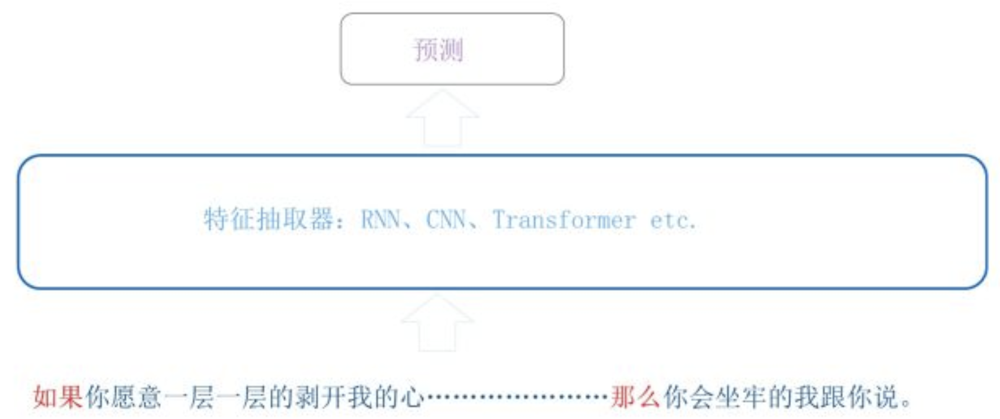
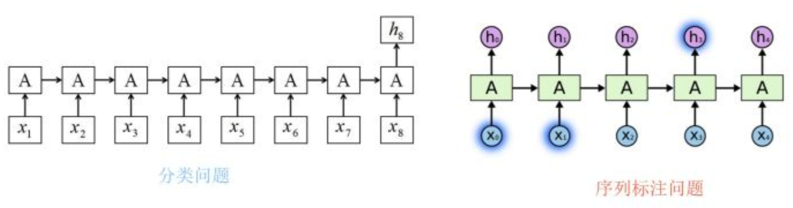
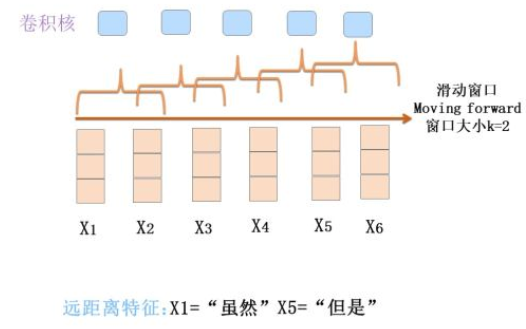
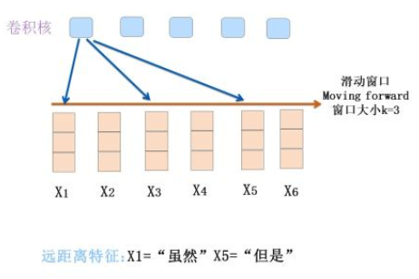
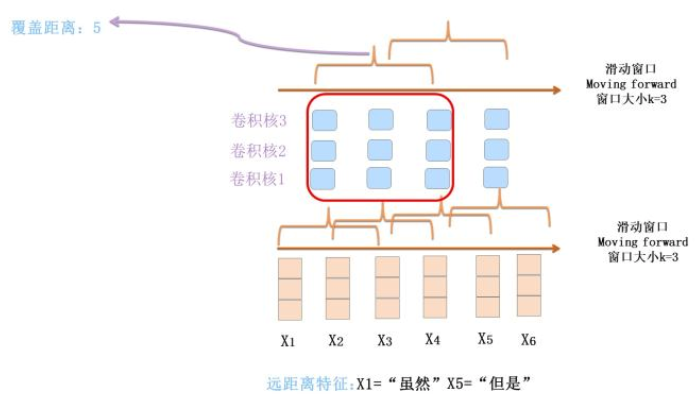
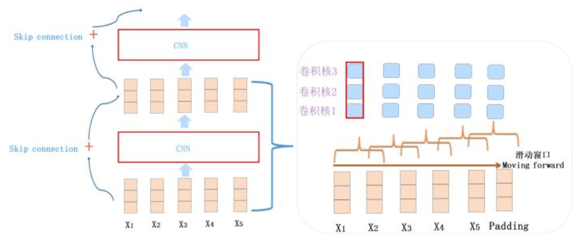
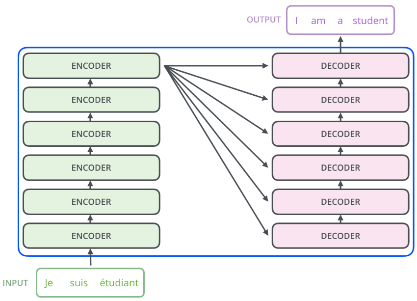

# 1.0

>   献给不安的沁颖，希望我能做得更好。

整理自[张俊林专栏](https://zhuanlan.zhihu.com/p/54743941)。

[TOC]

## NLP任务的特点

### 特点

1.  输入为一维的、**不定长的线性**序列；
2.  句子中单词的位置，或者子句的**相对位置**关系很重要："你欠我的钱不用还了" vs "我欠你的钱不用还了"；
3.  句子的**长距离特征**对于理解语义非常关键。

一个特征抽取器是否**匹配问题领域的特点**，有时候决定它的成败。而很多模型改进的方向，其实就是改造得使得它更匹配领域问题的特性。

### NLP四大类任务

#### 序列标注

>   分词/POS,  Tag/NER/语义标注..

*   要求模型根据上下文给出一个分类类别；

#### 分类任务

>   文本分类, 情感计算

*   不管文章多长，给出一个分类类别即可；

#### 句子关系判断

>   Entailment, QA, 自然语言推理

*   给定两个句子，判断出两个句子是否具备某种语义关系。

#### 生成式任务

>   机器翻译, 文本摘要, 写诗造句, 看图说话

*   输入文本内容后，自主生成一段文字

### 特征抽取器

*   从模型角度来讲，特征抽取器的能力在解决上述问题时极其关键。
*   深度学习"端到端"的能力使得我们不用手工设计特征。

## NLP三大特征抽取器

### RNN

#### RNN的特点

##### 原始RNN

*   采取线性序列结构不断从前往后收集输入信息
*   这种线性序列在反向传播时存在优化困难问题：因为反向传播路径太长，容易导致严重的**梯度消失**或**梯度爆炸**的问题。

##### LSTM和GRU

*   增加中间状态信息直接向后传播，缓解梯度消失问题。

##### 衍生模型

*   从图像领域借鉴并引入attention机制、叠加网络把层做深
*   引入encoder-decoder

#### 特点

*   RNN结构天然适配解决NLP问题
    *   适合不定长输入
    *   捕捉长距离特征

#### RNN面临的问题

*   RNN本身的序列依赖结构对于大规模并行计算来说相当不友好，很难具备高效的并行计算能力

### CNN

#### 怀旧版CNN

CNN最早用在NLP领域是在Kim et al.(2014)中，包含了完整的卷积层与池化层。

##### 缺陷之处1——无法捕捉长距离依赖

关键在于卷积核覆盖的滑动窗口，CNN能捕获的特征基本都体现在这个滑动窗口中。对于大小为$k$的滑动窗口，则$k$-gram片段信息是CNN捕获到的特征，$k$的大小决定了能捕获多远距离的特征。

对于怀旧CNN来说，它只有一个卷积层。如果滑动窗口最大为2，那么它无论上多少个卷积核，都不能捕捉到长度为5的距离的输入。即**无法捕捉长距离特征**。

##### Dilated CNN捕捉长距离特征

在卷积核长度固定的情况下，每个卷积核覆盖**不连续区域**的特征。

##### 加深CNN网络来捕获远距离特征

即深度CNN，和图像的多层卷积类似，通过叠加层数来增加卷积核的感知野。

**两种优化方法讨论**

*   Dilated CNN偏技巧一些，叠加卷积层需要精心设置超参数，不然连续跳跃会错过一些特征组合。
*   把CNN做深是主流方向，但是NLP问题上用CNN做不深，做到2到3层卷积就上不去了。不能做深的主要原因是深层网络参数优化手段不足导致的。

##### 缺陷之处2——池化层无法保留位置信息

1.  在NLP任务中，位置信息是很有用的，
    *   RNN中天然地会将位置信息编码进去；
    *   CNN通过窗口的从做到右滑动，捕获到的特征也有相对位置信息。
2.  卷积层后面立即接池化层，位置信息就可能会被抛弃了，
    *   在max pooling中，我们保留一个卷积核获得的特征向量中最强的特征，位置信息就被扔掉了；
    *   目前的发展趋势是抛弃池化层，只利用卷积层来叠加网络深度。

#### NLP当代主流CNN

##### 主体结构

图示为ConvS2S，Encoder包含15个卷积层，卷积核kernel size=3，覆盖输入长度为25.

*   通常由1-D卷积层来叠加深度
*   使用Skip Connection来辅助优化
*   可以引入Dilated CNN等手段
*   引入**GLU**门控非线性函数 (！！必须要看)

##### 位置编码

*   CNN的卷积层是保留了相对位置信息的，在中间层不要随便加入pooling的话，问题就不大；

*   也类似ConvS2S，专门在输入部分给每个单词增加一个位置编码，将单词的位置编码和词向量叠加形成单词输入。

##### 并行计算能力

CNN的并行自由度非常高：

*   对于单个卷积核而言，每个滑动窗口位置之间没有依赖关系，可以并行计算；
*   不同的卷积核之间没有相互影响，也可以并行计算。

### Transformer

这里主要指Transformer的Encoder，即图中六个“ENCODER”堆叠的部分。

Transformer的主要部件在以后的

#### 主要部件

*   Self-attention
*   Multi-head self-attention
*   Skip-connection
*   LayerNorm
*   Feed forward neural network

所有这些部件的共同作用使Transformer得效果变得更好

## 三大特征抽取器比较

