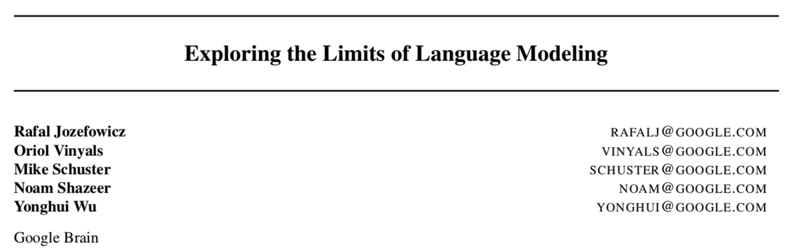
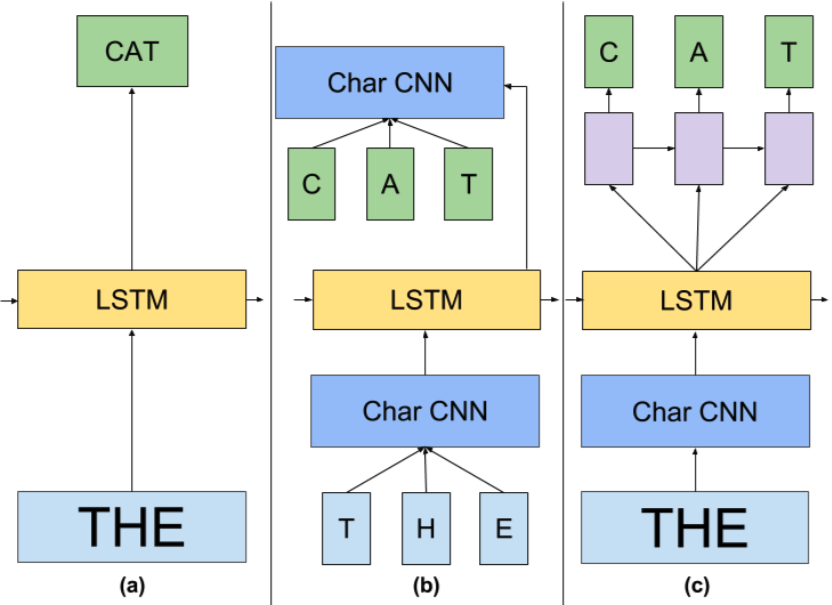
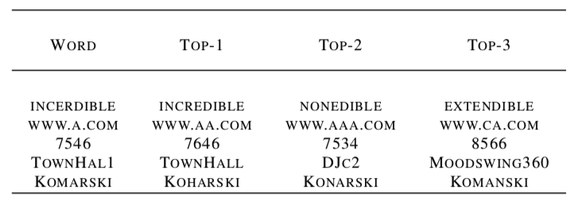
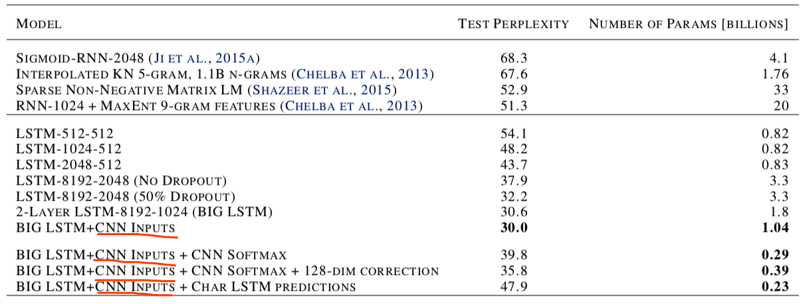
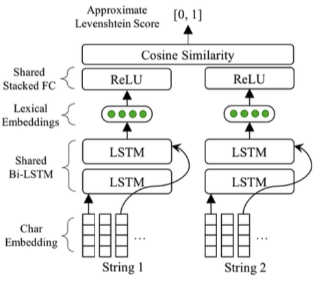

# #

>   献给迷茫的自己。
>
>   心有些焦虑，看不下完整的一篇论文，那就抽论文中最关键的点来看吧

[TOC]

## Exploring the Limits of Language Modeling

Google Brain 2016

### Word Embeddings vs Character CNN Embedding

1.  利用Word Embedding的话，词汇的数量巨大，导致参数量也很大。字符级别嵌入使得文本嵌入变得更加平滑，不要求模型输入的词在词汇表中，可以用在非正规的文本中并捕捉形态学特征(morphologically)；

2.  并没有带来表现上的损失，事实上，作者最好的模型就用了Char CNN；

3.  训练参数的数目下降(820M~72M，虽然训练的时间有所增长)，推断时并没有速度上的损失；

    

## Zeroshot Multimodal Named Entity Disambiguation for Noisy Social Media Posts
NAACL 2018

### Lexical Embeddings: Deep Levenshtein

作者训练了一个分离的神经网络来计算**近似编辑距离**，其中包含了一个共享参数的双向LSTM、字符嵌入矩阵、全连接层以及一个点积合并操作层。
$$
\min _{\mathbf{c}}\left\|\frac{1}{2}\left(\frac{\mathbf{c}\left(\mathbf{x}_{c}\right) \cdot \mathbf{c}\left(\mathbf{x}_{c}^{\prime}\right)^{\top}}{\left\|\mathbf{c}\left(\mathbf{x}_{c}\right)\right\|\left\|\mathbf{c}\left(\mathbf{x}_{c}^{\prime}\right)\right\|}+1\right)-\operatorname{sim}\left(\mathbf{x}_{c}, \mathbf{x}_{c}^{\prime}\right)\right\|^{2}\\
\text { where } \mathbf{c}\left(\mathbf{x}_{c}\right)=\left[\overrightarrow{\mathbf{h}_{c, L_{c}}} ; \overleftarrow{\mathbf{h}_{c, L_{c}}}\right]
$$

*   $\mathbf{c}(\cdot)$代表了字符级双向LSTM的输出，关于为什么使用LSTM，作者的回答是实验效果好；
*   $\operatorname{sim}(\cdot)$代表了DLN的输出(？？？)，结果是基于编辑距离的，标准化相似度分数，范围是[0, 1]；
*   $\left(\mathbf{x}_{c}, \mathbf{x}_{c}^{\prime}\right)$为任意两个字符串。

利用DLN产生的结果是两个字符串的近似编辑距离，最终将会利用$\mathbf{c}(\cdot)$的结果作为一个mention的字符表示。