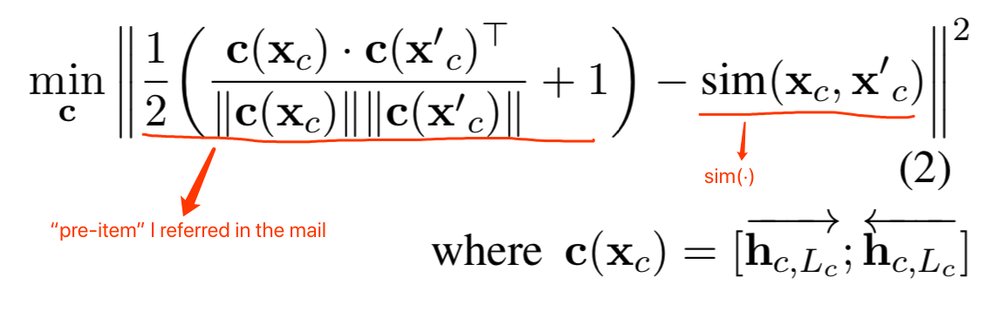
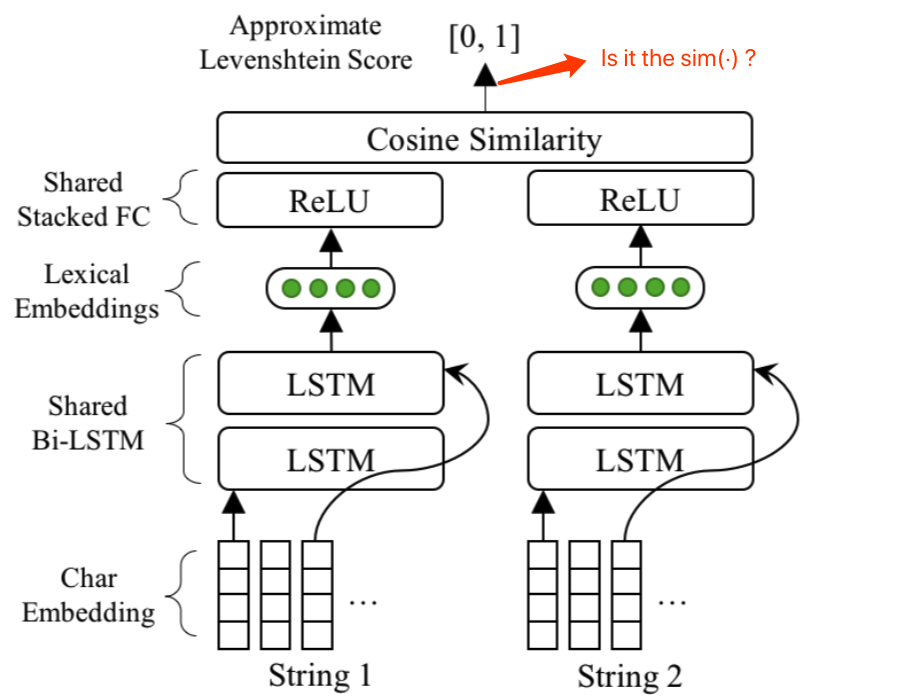

#### Questions

1.  If  *sim(*·*)* representation the output of last layer of DLN, what did the pre-item mean in Equation 2?
2.  If  *sim(*·*)* representation the exact Levenshtein Distance of  $(x_c, x′)$,  what are **the advantages of DLN comparing to** **the normal** **Levenshtein Distance** ?

#### Equation 2

#### Figure 3

