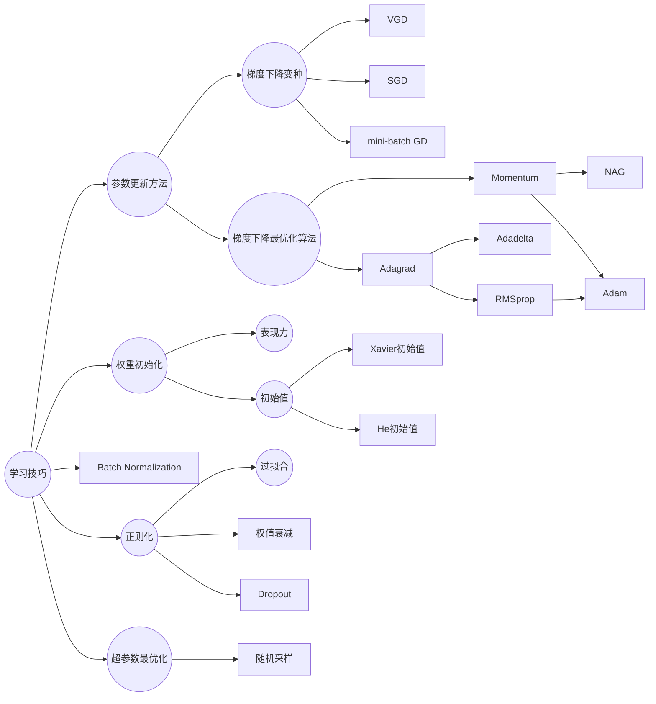
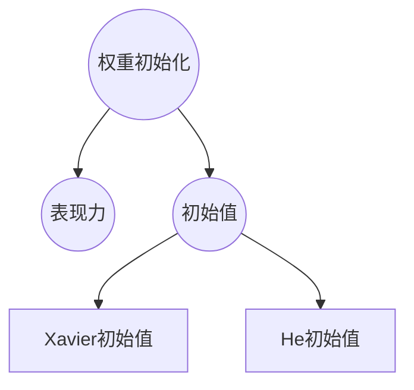
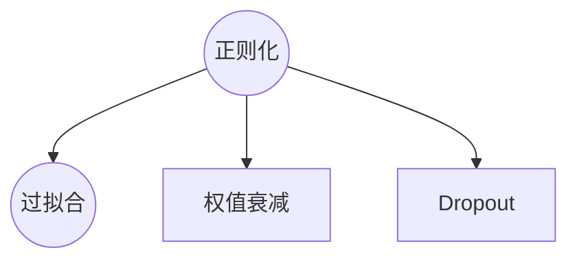
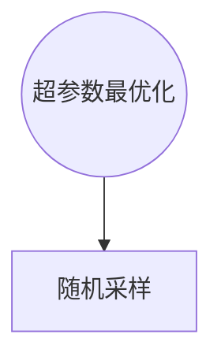

# #

与学习相关的技巧

[TOC]

## 与学习有关的技巧

```mermaid
graph LR

learn_trick((学习技巧))
opt((参数更新方法))
wei_init((权重初始化))
batch_norm[Batch Normalization]
reg((正则化))
hyper_para((超参数最优化))

learn_trick-->opt
GD((梯度下降变种))
VGD[VGD]
SGD[SGD]
MBGD[mini-batch GD]
opta((梯度下降最优化算法))
Mtu[Momentum]
NAG[NAG]
Adg[Adagrad]
Add[Adadelta]
RMSp[RMSprop]
Adam[Adam]
opt-->GD
GD-->VGD
GD-->SGD
GD-->MBGD
opt-->opta
opta-->Mtu
Mtu-->NAG
Mtu-->Adam
opta-->Adg
Adg-->Add
Adg-->RMSp
RMSp-->Adam


learn_trick-->wei_init
express((表现力))
init_val((初始值))
Xav[Xavier初始值]
HKM[He初始值]
wei_init-->express
wei_init-->init_val
init_val-->Xav
init_val-->HKM

learn_trick-->batch_norm


learn_trick-->reg
overfit((过拟合))
wei_decay[权值衰减]
dropout[Dropout]
reg-->overfit
reg-->wei_decay
reg-->dropout

learn_trick-->hyper_para
Ran_Sam[随机采样]
hyper_para-->Ran_Sam

```

## 权重初始化

``` mermaid
graph TD

wei_init((权重初始化))


express((表现力))
init_val((初始值))
Xav[Xavier初始值]
HKM[He初始值]

wei_init-->express
wei_init-->init_val
init_val-->Xav
init_val-->HKM
```

### 正则化

```mermaid
graph TD

reg((正则化))


overfit((过拟合))
wei_decay[权值衰减]
dropout[Dropout]

reg-->overfit
reg-->wei_decay
reg-->dropout
```

## 超参数最优化

```mermaid
graph TD

hyper_para((超参数最优化))


Ran_Sam[随机采样]

hyper_para-->Ran_Sam
```

