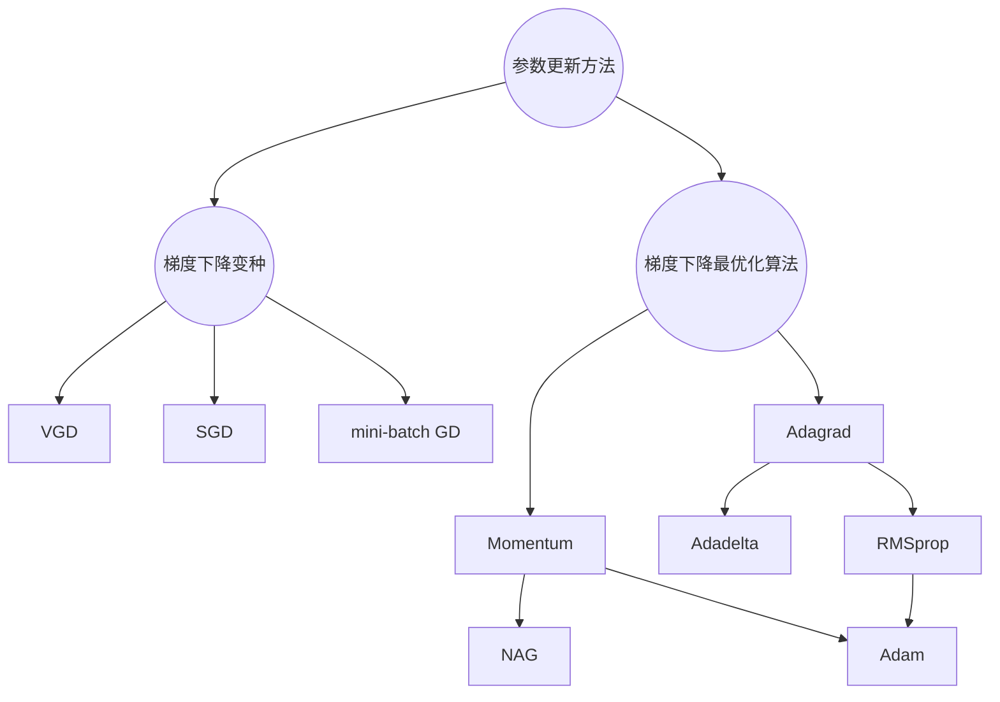

# #

[TOC]

>   改编自[原文](http://ruder.io/optimizing-gradient-descent/index.html)

*   模型的目标函数$J(\theta)$，其中$\theta\in\mathbb{R}^d$是模型的参数，**梯度下降法**利用目标函数的梯度$\nabla_{\theta} J(\theta)$的反方向来更新参数$\theta$；
*   学习率$\eta$决定了更新的步长；

---

## 梯度下降的变种

*   梯度下降法有三个变种，它们的区别在于利用多少数据来计算目标函数的梯度；
*   对于一定数量的数据，我们在**参数更新准确率**和**更新的时间开销**之间做权衡。

### Batch gradient descent

>   Vanilla gradient descent

Batch gradient descent在整个训练集上计算损失函数相对于参数的梯度，来更新参数：
$$
\theta=\theta-\eta \cdot \nabla_{\theta} J(\theta)
$$
因为在*一次*更新中计算整个训练集的梯度，Batch gradient descent可能会**非常的慢**，而且**不适用于过大而不能装进内存的数据集**，并且**不支持模型的在线更新**(添加新的样本)。

Batch gradient descent在**凸曲面**上能保证收敛到全局最小值，在非凸曲面能够收敛到局部最小值。

### Stochastic gradient descent

SGD对于每个训练样本$(x^{(i)},y^{(i)})$执行一次参数更新:
$$
\theta=\theta-\eta \cdot \nabla_{\theta} J\left(\theta ; x^{(i)} ; y^{(i)}\right)
$$

*   Batch gradient descent对于大型数据集上执行了许多**冗余计算**，在每次参数更新之前，它又为相似的样本重新计算了梯度；
*   SGD每次计算一个样本的梯度进行更新，通常它**更加迅速**，而且支持**在线学习**；
*   SGD以一个较高的方差执行更新，这样导致了目标函数像下图一样剧烈波动：
    

相较于Batch gradient descent，SGD一方面能够**跳出局部最优**寻求更优解，另一方面，这使得它最终**收敛到一个确切的最小值变得复杂**。在训练过程中逐渐减少学习率时，SGD表现出和Batch gradient descent相一致的结果。

### Mini-batch gradient descent

Mini-batch gradient descent结合了以上两者的特点，它为训练样本中的每个包含$n$个训练样例的数据执行一次更新：
$$
\theta=\theta-\eta \cdot \nabla_{\theta} J\left(\theta ; x^{(i : i+n)} ; y^{(i : i+n)}\right)
$$
这种方法：

-   **减少参数更新的方差**，能够更加稳定地收敛；
-   能够利用**高度优化的矩阵运算**来计算梯度。

### 挑战

Vanilla mini-batch gradient descent依然不能够保证很好地收敛，比如**函数的形状非均向**。SGD低效的根本原因是，**梯度的方向并没有指向最小值的方向**。以下是它面临的一些挑战：

1.  **难以选择合适的学习率**：过小导致收敛缓慢，过大妨碍参数收敛，使损失一直在最小值附近波动；
2.  **学习率规划**试图在训练时调整学习率：利用预定义的规划或者在迭代次数小于一定阈值时减少学习率。这些规划或是阈值都是**预先定义**的，不能适应数据集的特点；
3.  **所有的参数都服从相同的学习率进行更新**：如果数据稀疏而且不同特征出现的频数有较大差别，我们可能不希望在相同的尺度进行进行，而是对出现频次较少的特征执行更大尺度的更新；
4.  最小化高度非凸函数时需要避免陷入许多**局部最优点**。除此之外，**鞍点**是更加棘手的问题，鞍点通常被相同误差的"高原"所包围。**鞍点每个维度的梯度都为0**，这使得SGD无法从中逃脱。

---

## 梯度下降最优化算法

### Momentum

**SGD难以解决函数的形状非均向的问题**，即一个维度上的变化要比其他维度的变化陡峭的多，通常在局部最优附近会出现这种情况。在这些场景中，SGD会剧烈震荡，影响它达到局部最优点。

| SGD                                                          | 动量                                                         |
| ------------------------------------------------------------ | ------------------------------------------------------------ |
|  |  |

动量能够减小SGD的摆动，加快相关方向的收敛速度，它利用一个额外的参数$\gamma$来将上一步更新的向量加入到当前更新的向量中：
$$
\begin{aligned} v_{t} &=\gamma v_{t-1}+\eta \nabla_{\theta} J(\theta) \\ \theta &=\theta-v_{t} \end{aligned}
$$
$\gamma$通常被设置为0.9。

动量就像将一个小球推下山。小球在下山时不断加速(直到终极速度，如果有空气阻力的话)。在利用动量更新时，梯度方向不变的维度上更新速度较快，梯度方向改变的维度上更新速度会减少。这样能够**增加收敛速度**并且**减少震荡**。

### Nesterov accelerated gradient

*   利用当前值来估计**下一步的近似位置**。

将球推下山，盲目地滚向下坡是不够的。我们需要一个聪明的球，在再一次上坡之前减缓速度。

NAG给予动量这种预见性。我们利用动量项$\gamma v_{t-1}$来移动参数$\theta$，计算$\theta-\gamma v_{t-1}$估计**下一步中参数的近似位置**。我们现在可以计算"**未来参数**"的梯度来预知前方的情况：
$$
\begin{aligned} v_{t} &=\gamma v_{t-1}+\eta \nabla_{\theta} J\left(\theta-\gamma v_{t-1}\right) \\ \theta &=\theta-v_{t} \end{aligned}
$$
同样，将动量参数$\gamma$的值设置在0.9。

*   动量首先计算**当前位置的梯度值**(蓝色短箭头，$\nabla_{\theta} J(\theta)$)，然后在更新后的累加梯度方向上进行飞跃(蓝色长箭头，$\gamma v_{t-1}+\eta \nabla_{\theta} J(\theta)$)；
*   NAG首先在上一步的累加梯度的方向上进行飞跃(棕色箭头，$\gamma v_{t-1}$)，然后计算未来的梯度对当前的方向进行校正(红色箭头，$\gamma v_{t-1}+\eta \nabla_{\theta} J\left(\theta-\gamma v_{t-1}\right)$)。这种预先的更新**防止参数更新过快**而提高响应能力，在一些任务中提高了RNN的表现。

在[知乎专栏](https://zhuanlan.zhihu.com/p/22810533)中提到，NAG是原始动量加上当前位置的**二阶导信息**。

现在，参数更新能够适应损失函数的倾斜程度，并且提高了SGD的收敛速度。我们还想要依照它们的重要性，对单个独立的参数进行幅度不同的更新。

### Adagrad

*   **为每一个参数自动调节学习率**。

Adagrad依然是基于梯度的最优化方法，它仅仅和梯度下降有以下的不同：它**对每一个参数都进行了学习率的调整**，对于频繁出现的特征分配较小的学习率；对于不频繁的特征分配较大的学习率。所以，Adagrad**适合处理稀疏数据**。Glove的训练就利用了Adagrad给予稀有词更大的更新。

在时间步$t$，Adagrad给予每个变量$\theta_i$不同的学习率。为了简介，我们用$g_t$代表时间步$t$的梯度，$g_{t,i}$代表时间步$t$下，对于参数$\theta_ i$部分派生的目标函数：
$$
g_{t, i}=\nabla_{\theta} J\left(\theta_{t, i}\right).
$$

在时间步$t$，利用SGD对于每个参数$\theta _i$的更新就变成了：
$$
\theta_{t+1, i}=\theta_{t, i}-\eta \cdot g_{t, i}
$$
相较于SGD，在时间步$t$，Adagrad根据每个参数$\theta _i$已经计算过的梯度，修改了学习率：
$$
\theta_{t+1, i}=\theta_{t, i}-\frac{\eta}{\sqrt{G_{t, i i}+\epsilon}} \cdot g_{t, i}.
$$
其中，$G_t\in \mathbb{R}^{d \times d}$是对角矩阵，其中每个对角元素$i.i$是参数$\theta_i$直到时间步$t$梯度的平方和，$\epsilon$为平滑项(通常设为$1e{-8}$。

Adagrad的*主要优点*是它**不需要手动地调节学习率**$\eta $，大多数实现都采用默认值0.01并保持不变。

Adagrad的*主要缺点*是分母上的平方梯度累加：因为每次累加的值都是整数，所以累加和在训练时会逐渐变大。这导致学习率的下降，并**最终跌落至无穷小**，此时参数就无法得到更新，使训练提前结束。

下面的方法试图解决这个缺点。

### Adadelta

*   **没有使用学习率**这个超参数，即**对超参数不敏感**；
*   保留两个变量：**过去参数、梯度的近似均方**。

Adadelta是Adagrad的一个扩展，它试图缓解Adagrad凶猛的、单调递减的学习率。相较于累加过去所有的平方和，Adadelta限制累加过去梯度的窗口大小为$w$。

并非是真正地存储了$w$个过去的平方梯度，梯度和被递归地定义为所有**过去平方梯度的递减平均值**。当前时间步$t$的均值$\ E\left[g^{2}\right]_{t}$仅仅依赖于上一步的均值和当前的梯度，是一个**近似的平均值**：
$$
E\left[g^{2}\right]_{t}=\gamma E\left[g^{2}\right]_{t-1}+(1-\gamma) g_{t}^{2}
$$
我们将$\gamma $设为和动量相似的值，约为0.9。

为了将公式整理得更加清晰一些，我们将SGD写为$\Delta \theta_{t}$更新参数的过程：
$$
\begin{aligned} \Delta \theta_{t} &=-\eta \cdot g_{t, i} \\ \theta_{t+1} &=\theta_{t}+\Delta \theta_{t} \end{aligned}
$$
这样，上面提到的Adagrad的更新参数可以写成下面的形式：
$$
\Delta \theta_{t}=-\frac{\eta}{\sqrt{G_{t}+\epsilon}} \odot g_{t}.
$$
现在，我们将对角矩阵$G_t$简化为平方梯度的衰减平均值$E[g^2]_t$：
$$
\Delta \theta_{t}=-\frac{\eta}{\sqrt{E\left[g^{2}\right]_{t}+\epsilon}} g_{t}
$$
因为，分母上的值就是梯度的**均方根**(root mean squared, RMS)误差，所以，我们可以将其替换：
$$
\Delta \theta_{t}=-\frac{\eta}{RMS[g]_t} g_{t}.
$$
此外，Adadelta额外一个状态变量：$E\left[\Delta \theta^{2}\right]_{t}$参数的递减平均值，来确保更新中的"假设单位“(hypothetical units)和参数相同(待深入研究)：
$$
E\left[\Delta \theta^{2}\right]_{t}=\gamma E\left[\Delta \theta^{2}\right]_{t-1}+(1-\gamma) \Delta \theta_{t}^{2}.
$$
则更新参数的均方误差可以写作：
$$
RMS[\Delta \theta]_{t}=\sqrt{E\left[\Delta \theta^{2}\right]_{t}+\epsilon}
$$
在时间步$t$，$RMS[\Delta \theta]_{t}$还是未知的($\theta_t$还没有被求出来)，所以我们利用上一个时间步的参数均方误差$RMS[\Delta \theta]_{t-1}$作为当前值的近似，最终Adagrad的更新规则为:
$$
\begin{aligned} \Delta \theta_{t} &=-\frac{R M S[\Delta \theta]_{t-1}}{R M S[g]_{t}} g_{t} \\ \theta_{t+1} &=\theta_{t}+\Delta \theta_{t} \end{aligned}
$$
可以看出，Adadelta不需要预先设定学习率，在更新规则中已经将这一个参数舍弃。

### RMSprop

*   维护**过去梯度的近似均方**。

RMSprop是由Hinton提出的，自适应学习率的参数更新方法。RMSprop和Adadelta一样，针对Adagrad的特点进行优化。(均方根RMS + 传播propagate)

事实上，RMSprop和Adadelta的第一个更新向量相同，都维护了参数的均方根误差：
$$
\begin{aligned}
E\left[g^{2}\right]_{t}&=\gamma E\left[g^{2}\right]_{t-1}+(1-\gamma) g_{t}^{2}\\
\theta_{t+1}&=\theta_{t}-\frac{\eta}{\sqrt{E\left[g^{2}\right]_{t}+\epsilon}} g_{t}
\end{aligned}
$$
RMSprop也是通过学习率除以指数衰减的梯度平方的均值来改变学习率的。Hinton建议$\gamma$的默认值设为0.9，$\eta$值的默认值设为0.01。

### Adam

*   保留两个参数：**过去平方梯度的指数衰减均值$v_t$**和**过去梯度的指数衰减均值**$m_t$。
*   **偏置纠正**算法：抵抗参数倾向为0；

Adaptive Moment Estimation(Adam)是另一个为每个参数计算自适应学习率的算法。相较于Adadelta和RMSprop，Adam不仅仅计算了**过去平方梯度的指数衰减均值**$v_t$，它还和Momentum一样保留了**过去梯度的指数衰减均值**$m_t$。Momentum可以看成是一个小球滚下斜坡，Adam的行为可以看成是带有摩擦力的重球，更倾向于错误表面的**平坦的最小值**。过去平方梯度的指数衰减均值$v_t$和过去梯度的指数衰减均值$m_t$的计算方式如下：
$$
\begin{aligned} m_{t} &=\beta_{1} m_{t-1}+\left(1-\beta_{1}\right) g_{t} \\ v_{t} &=\beta_{2} v_{t-1}+\left(1-\beta_{2}\right) g_{t}^{2} \end{aligned}
$$
$m_t$和$v_t$分别是第一时刻(the mean)和第二时刻(the uncentered variance)的梯度，它们的变量名由此而来。因为$m_t$和$v_t$由零向量初始化，Adam的作者观测到它们**倾向为零**，特别是初始时间步和特别是衰减率特别小时(即$\beta_1$和$\beta_2$趋近1的时候)。

作者使用了一种**偏置纠正**的算法来抵抗这种倾向：
$$
\begin{aligned} \hat{m}_{t} &=\frac{m_{t}}{1-\beta_{1}^{t}} \\ \hat{v}_{t} &=\frac{v_{t}}{1-\beta_{2}^{t}} \end{aligned}
$$
然后，作者使用和Adadelta和RMSprop一样的参数更新方法，生成了Adam的参数更新规则：
$$
\theta_{t+1}=\theta_{t}-\frac{\eta}{\sqrt{\hat{v}_{t}}+\epsilon} \hat{m}_{t}.
$$
作者建议$\beta_1$的默认值为0.9，$\beta_2$的默认值为0.999，$\epsilon$的默认值为$1e-8$。作者的经验证明Adam在实践中效果较于其他自适应的学习算法要好。

### 算法图示

从等高线的SGD最优化方法图示中可以看到，Adagrad、Adadelta、RMSprop方法能够迅速调转到正确的方向，但是Momentum和NAG偏离了轨道。NAG能够通过预知能力更快地转换到正确方向。

从鞍点的SGD最优化方法图示看出，Momentum和NAG难以打破对称更新，而Adagrad、Adadelta、RMSprop能够快速地面下下坡。

| 等高线的SGD最优化方法                                        | 鞍点的SGD最优化方法                                          |
| ------------------------------------------------------------ | ------------------------------------------------------------ |
|  |  |

### 优化器的选择

*   如果输入的**数据稀疏，选择自适应的学习率更新方法**会得到更好的结果，并且不需要手动调整学习率；
*   RMSprop、Adadelta是Adagrad的改进，解决了其学习率下降的问题，不同的是Adadelta在更新规则中加入了参数更新的均方根；Adam将Momentum和偏差纠正的方法加入到RMSprop中。RMSprop、Adadelta和Adam在某种程度上是相似的算法；
*   经验表明，偏差纠正的加入使得Adam的效果略优于RMSprop。总体上看，Adam可能是最好的选择。

目前，许多最近的工作仅仅使用SGD加上简单的学习率退火规划。SGD通常能够找到一个极小值，但是它一般耗费的时间更长，并且依赖于一个健壮的初始值和退火规划。因此，**如果要求快速收敛、训练一个复杂的深度神经网络时，应该选择自适应学习率的算法**。

---

## 其他优化SGD的策略

介绍一些其他能够优化SGD效果的策略。

### 随机学习、课程学习

通常，为了不让优化算法形成某种偏见，我们希望**避免将训练数据排列成一个有意义的顺序**。因此，一般在每一个epoch中将训练数据打乱。

另一方面，在一些情况下，我们希望能够解决难度递增的问题，将训练数据按照一个有意义的顺序排列能够改善学习效果并且更好地收敛。这种建立有意义的顺序的方法叫做**课程学习**(Curriculum Learning)。

经验表明，在训练LSTM时，利用混合的学习策略能够达到更好效果。

### Batch normalization

*   使学习快速进行；
*   不那么依赖初始值；
*   降低过拟合(降低Dropout等的必要性)。

为了便利学习，我们通常会利用**零均值**和**单位方差**来规范化参数的初始值。在训练的过程中，我们会逐渐丢失正则化，当网络层次较深时，这样会使训练变慢、使变化放大。

Batch normalization为每一个mini-batch重建这种规范性(均值为0，方差为1)，并且改变通过它反向传播到前面的层次。在模型架构中使用Batch normalization后，我们能够使用更高的学习率并且减少对初始化参数的关注。Batch normalization还可作为一个正则器，减少(甚至消除)模型对Dropout的需要。

### Early Stopping

在训练时监视模型在验证集的误差，如果误差得不到充分的更新时提前结束。

### 梯度噪音

Neelakantan等人利用一个高斯分布对对每个梯度更新添加噪音：
$$
g_{t, i}=g_{t, i}+N\left(0, \sigma_{t}^{2}\right).
$$
方差根据如下的策略退火：
$$
\sigma_{t}^{2}=\frac{\eta}{(1+t)^{\gamma}}.
$$
作者们认为添加这个噪音能够使网络在不好的初始化时变得更加健壮，特别是训练复杂的深度神经网络时。他们怀疑噪音给了模型更多的机会来摆脱局部最优。

