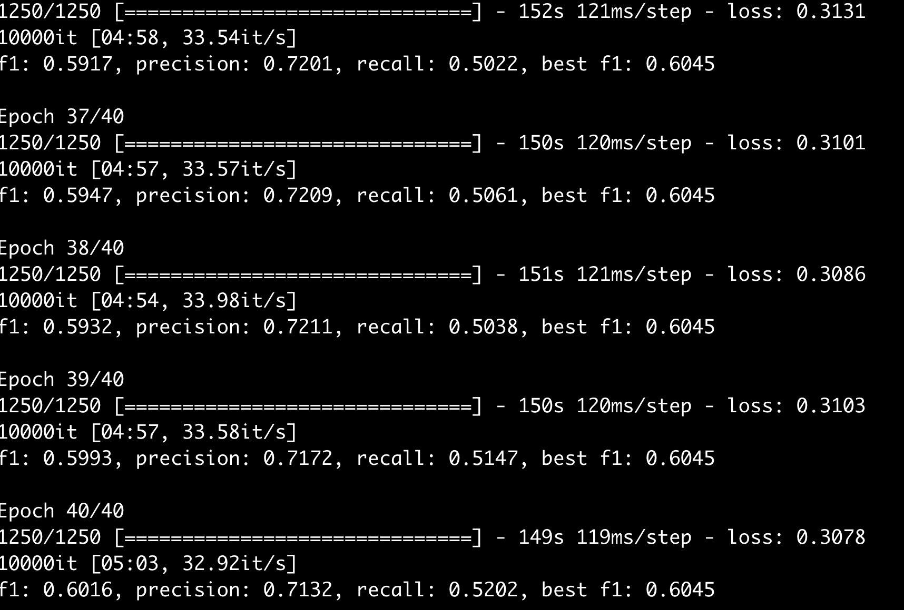

# #

模型记录

[TOC]

## 表格记录

| 时间 |          模型           | 参数 | 语料 | 训练结果  |          提交结果          |
| :--: | :---------------------: | :--: | :--: | :-------: | :------------------------: |
| 5.20 |        baseline         | 默认 | 全部 |  F1等于0  |            待查            |
| 5.21 |        baseline         | 默认 | 全部 | F1=0.600  | F1=0.658, P=0.713, R=0.610 |
| 5.22 |  baseline-mixed-actree  | 默认 | 全部 |   同上    | F1=0.650, P=0.686, R=0.617 |
| 5.22 | actree识别，basline链接 | 默认 | 全部 |   同上    | F1=0.529, P=0.452, R=0.638 |
| 5.23 |    Baseline 47epoch     | 默认 | 全部 | F1=0.6045 | F1=0.660, P=0.707, R=0.638 |
| 5.24 |   baseline actree mix   | 默认 | 全部 |   同上    | F1=0.659 P=0.700, R=0.623  |
|      |                         |      |      |           |                            |

## 5月23日

依然是baseline

## 5月22日

今天利用actree做了实体识别，将其替代了模型的实体识别，但是效果不理想.

## 5月20日

### 待进行

1.  在评估时的准确率、F1为0，需排查
    *   排查成功 - 结果类型没有对齐
2.  使用训练好的模型来预测，提交baseline