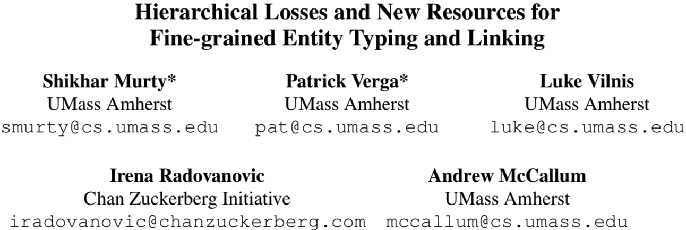
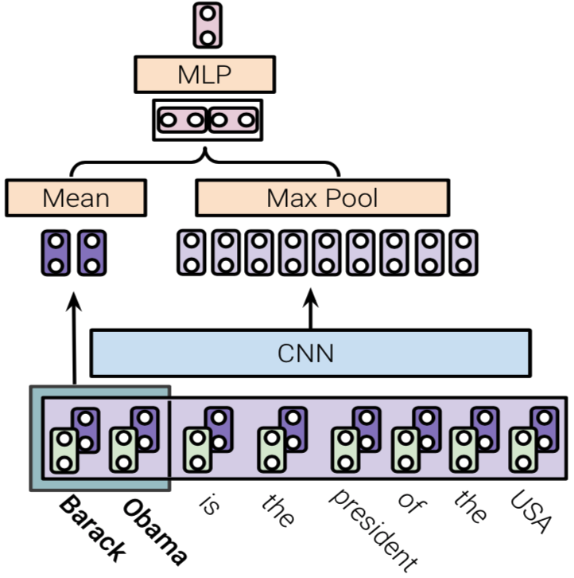

# #

## 模型

### 实体识别和实体链接

#### 定义

*   定义带有识别出的实体的句子为文本mention $m$；

*   任务是将$m$分类，打上一个或多个标签

>   $m$ = “*Barack Obama is thePresident of the United States.*”	with entity string **Barack Obama**.

##### 实体链接

*   将**Barack Obama**映射到知识库的某个实体上

##### 实体识别

1.  从mention的角度考虑 *mention-level typing*

将mention打上一个或多个标签：$t^m={president, leader, politician}$;

2.  从实体的角度考虑

    一个包里的所有的mention $B_e$都指向相同的实体，则将$B_e$打上标签$t^e$，表示集合中所有的mention都有$t^e$属性。

### Mention Encoder

*   将每一个mention $m$转换为$d$维向量，用分类mention的类型或mention中的实体？？；(mention到底是什么？)
    *   串联the mention string的平均词向量与CNN的输出
    *   词向量捕捉上下文无关的语义联系；
    *   CNN捕捉上下文相关的联系

#### Token Representation

