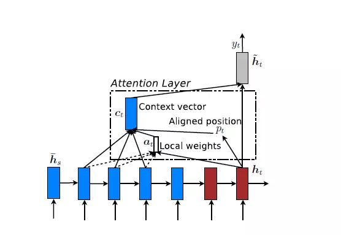

# 0

>   献给热爱整理的你。

[TOC]

---

## 1. Attention Mechanism 原理

### 1.1 主要解决的问题

>   注意力机制（Attention Mechanism）最早是应用于图像领域，其基本原理是通过算法来模拟人类集中注意力的行为。Mnihet et al.(2014)在RNN模型上使用Attention进行图像分类，结果取得了很好的性能。随后，Bahdanau et al.(2015)在Sutskever et al.(2014)机器翻译工作的基础上，使用注意力机制将翻译和对齐同时进行，他们的工作第一词将注意力机制是用在了自然语言处理上的。接着，Xu et al.(2015)成功地将注意力机制应用在图像标注任务中。从此，注意力机制就被广泛应用在基于RNN神经网络模型中。随后，如何在CNN中使用注意力机制也成为了研究的热点。在2017年，Google发表的论文《Attention Is All You Need》中，提出的模型Transformer在机器翻译上大量依赖自注意力机制（self-attention）来学习文本表示，达到了当时的最优水平。同时，利用基于Transformer的Bert与GPT2.0模型预训练的词向量特征，在许多任务与评测上都取得了最优的效果。

1.  在论文*Sequence to Sequence Learning with Neural Networks*中，Seq2Seq模型存在两个问题：
    1.  把输入$\boldsymbol{x}$的所有信息有压缩到一个固定长度的隐向量$c$，忽略了输入$\boldsymbol{x}$的长度。
        当输入句子长度很长，特别是比训练集中最初的句子长度还长时，模型的性能急剧下降。
    2.  把输入$\boldsymbol{x}$编码成一个固定的长度，对于句子中每个词都赋予相同的权重，这样做是不合理的。
        比如，在机器翻译里，输入的句子与输出句子之间，往往是输入一个或几个词对应于输出的一个或几个词。因此，对输入的每个词赋予相同权重，这样做没有区分度，往往是模型性能下降。

2.  同样的问题也存在于图像识别领域，卷积神经网络CNN对输入的图像每个区域做相同的处理，这样做没有区分度，特别是当处理的图像尺寸非常大时，问题更明显。
    因此，2015年，Dzmitry Bahdanau等人在*Neural machine translation by jointly learning to align and translate*提出了Attention Mechanism，用于对输入$\boldsymbol{x}$的不同部分赋予不同的权重，进而实现软区分的目的。

### 1.2 Attention Mechanism 原理

#### 1.2.1 Seq2Seq 原理

>   原文：Neural Machine Translation By Jointly Learning To Align And Translate
>
>   标志符：
>
>   * 输入序列：$\mathbf{x}=\left(x_{1}, \cdots, x_{T_{x}}\right)$
>   * 输出序列：$\mathbf{y}=\left(y_{1}, \cdots, y_{T_{y}}\right)$

1. 传统的Seq2Seq结构
  
   *   
   
   * 传统的Seq2Seq结构分为两个部分：Encoder和Decoder。如上图所示，Encoder利用一个RNN把一个**变长**的输入序列$\mathbf{x}=\left(x_{1}, \cdots, x_{T_{x}}\right)$编码成一个**定长**的隐向量（背景向量、上下文向量context）$c$，
     $$
     h_{t}=f\left(x_{t}, h_{t-1}\right)\\
     c=q\left(\left\{h_{1}, \cdots, h_{T_{x}}\right\}\right)
     $$
     其中，$h_{t} \in \mathbb{R}^{n}$为RNN在$t$时刻的隐含变量，$f$和$q$都为非线性函数；在[ Sutskever *et al.* (2014)](https://arxiv.org/pdf/1409.3215.pdf)中$q\left(\left\{h_{1}, \cdots, h_{T}\right\}\right)=h_{T}$, $f=LSTM$.
     
   * $c$有两个作用：
   
       1.  作为初始向量初始化decoder的模型，即作为decoder模型预测$y_1$的==**初始向量**==。
   
       2.  作为==**背景向量**==，指导$y$序列中每一个step的$\mathbf{y}$的产出。decoder主要基于背景向量$c$和上一步的输出$y_{t-1}$解码得到该时刻$t$的输出$y_t$，直到碰到结束标志（<EOS>）为止。
   
   * 每个条件概率：
       $$
    p\left(y_{t} |\left\{y_{1}, \cdots, y_{t-1}\right\}, c\right)=g\left(y_{t-1}, s_{t}, c\right)
       $$
       
   
2.  加入了注意力机制的模型结构

    

    * 如上所述，传统的Seq2Seq模型对输入序列$\mathbf{x}$缺乏区分度，因此，2015年，Kyunghyun Cho等人在论文*Learning Phrase Representations using RNN Encoder–Decoder for Statistical Machine Translation*中，引入了Attention Mechanism来解决这个问题。

    * 在该模型中，定义了一个条件概率：

        -   $$
            p\left(y_{i} | y_{1}, \ldots, y_{i-1}, \mathbf{x}\right)=g\left(y_{i-1}, s_{i}, c_{i}\right)
            $$

        其中，$s_{i}$是decoder中的RNN在$i$时刻的隐状态：
        $$
        s_{i}=f\left(s_{i-1}, y_{i-1}, c_{i}\right)
        $$
        这里的背景向量$c_i$的计算方式，与传统的Seq2Seq模型直接累加的计算方式不一样。这里的$c_i$对于每个$y_i$来说是不一样的，它是一个权重化（Weighted）之后的值，其表达式为：
        $$
        c_{i}=\sum_{j=1}^{T_{x}} \alpha_{i j} h_{j}
        $$
        其中，$i$表示encoder端的第$i$个词，$h_j$表示encoder端的第$j$个词的隐向量，$\alpha_{i j}$表示encoder端的第$j$个词与decoder端的第$i$个词之间的权值，表示源端第$j$个词对目标端第$i$个词的影响程度，$\alpha_{i j}$的计算公式如公式所示：
        $$
        {\alpha_{i j}=\frac{\exp \left(e_{i j}\right)}{\sum_{k=1}^{T_{x}} \exp \left(e_{i k}\right)}}\\\\{e_{i j}=\operatorname{score}\left(s_{i-1}, h_{j}\right)}
        $$
        其中，$\alpha_{i j}$是一个*softmax*模型输出，概率值的和为1。$e_{i j}$表示一个**对齐模型**(*alignment model*)，用于衡量encoder端的位置$j$的词，对于decoder端的位置$i$的词的对齐程度（影响程度），换句话说：decoder端生成位置$i$的词时，有多少程度受encoder端的位置$j$的词影响。对齐模型$e_{i j}$的计算方式有很多种，不同的计算方式，代表不同的Attention模型，最简单且最常用的的对齐模型是dot product乘积矩阵，即把target端的输出隐状态$h_ t$与source端的输出隐状态$s_{i-1}$进行矩阵乘。常见的==**对齐计算方式**==如下
        $$
        \operatorname{score}\left(s_{i-1}, h_{j}\right)=\left\{\begin{array}{}{s_{i-1}^{\top} {h}_{j}} & {\text { dot }} \\ {s_{i-1}^{\top} \boldsymbol{W}_{a} {h}_{j}} & {\text { general }} \\ {v_{a}^{\top} \tanh \left(W_{a}\left[s_{i-1} ; {h}_{j}\right]\right)} & {\text { concat }}\end{array}\right.
        $$
        其中，${e_{i j}=\operatorname{score}\left(s_{i-1}, h_{j}\right)}$表示源端与目标单单词对齐程度，其中的参数与Seq2Seq的参数一同训练 的。常见的对齐关系计算方式有：

        -   点乘（Dot product）
        -   权值网络映射（General）
        -   串联映射 (Concat)

* 在decoder端的注意力机制，将encoder从编码源句子中的的所有信息到一个固定长度的向量的压力中中解放出来。

#### 1.2.2 Attention Mechanism

1.  从Seq2Seq中剥离出Attention

    * Attention在Seq2Seq中的作用是在source端中寻找与当前输出值最相关的部分，并分配给这些部分较高的权重；
    * 我们将decoder端用来计算attention的隐状态$s_{i-1}$(上一个timestep的隐含层输出)看做一个查询**Query**，将encoder端的隐含层输出$h_{1…T}$看作为键值**Key**，则计算attention的步骤可看做是一个查询到一系列键值对的映射。

    * 上图中，$\operatorname{F}(Q,K)$等于前述的$\operatorname{score}(s_{i-1}, h_{j})$，Seq2Seq计算过程中$Key_i$常常等于$Value_i$.

2.  Attention工作步骤

    1.  **Query**和**Key**进行相似度计算得到权值；
    2.  对得到的权值进行归一化；
    3.  利用归一化结果对**Value**求带权和。

3.  从软寻址的角度看Attention
    * 在一般情况下，我们对键值对**Key-Value**查找时，当$Query=Key_i$时，取出对应的$Value_i$;
    * Attention的过程中，通过**Query**查找**Key**时，不需要两者相等才取出值。软寻址先计算**Query**和**Key**的相似度，然后取出对应的**Value**值后乘上相似度，作为查询该**Key**的结果。

#### 1.2.3 Attention的优劣

1.  优点
    1.  灵活地捕捉全局和局部状态的联系，对比RNN很难捕捉长距离依赖；
    2.  能够并行处理减少模型计算时间。Attention机制本身并不依赖于上一不产生的结果，因此可以像CNN一样并行处理。
    3.  相比RNN与CNN，注意力机制用到的参数更少，模型复杂度更低。
2.  缺点
  
    1.  不能捕捉序列顺序，是一个精致的BOW模型；
    
    *   在后来的Transformer中， 加入了元素的位置信息。

---

## 2. Attention Mechanism 分类

### 2.1 soft Attention 和hard Attention (补充)

* Kelvin Xu等人与2015年发表论文《Show, Attend and Tell: Neural Image Caption Generation with Visual Attention》，在Image Caption中引入了Attention，当生成第$i$个关于图片内容描述的词时，用Attention来关联与$i$个词相关的图片的区域。Kelvin Xu等人在论文中使用了两种Attention Mechanism，即**Soft Attention**和**Hard Attention**。
    * 我们之前所描述的传统的Attention Mechanism就是Soft Attention。Soft Attention是**参数化**的（Parameterization），因此可导，可以被嵌入到模型中去，直接训练。梯度可以经过Attention Mechanism模块，反向传播到模型其他部分。
    * 相反，Hard Attention是一个随机的过程。Hard Attention不会选择整个encoder的输出做为其输入，Hard Attention会依概率Si来采样输入端的隐状态一部分来进行计算，而不是整个encoder的隐状态。为了实现梯度的反向传播，需要采用蒙特卡洛采样的方法来估计模块的梯度。
    * 两种Attention Mechanism都有各自的优势，但目前更多的研究和应用还是更倾向于使用Soft Attention，因为其可以直接求导，进行梯度反向传播。

### 2.2 Global Attention 和 Local Attention

#### 2.2.1 Global Attention

* 和上述的Attention model一样：所有的hidden state都被用于计算Context vector的权重，即变长的对齐向量$a_t$，注意力向量长度等于encoder端输入句子的长度。

* 这张图中的一些符号解释：

    * $\overline{h}_s$代表源序列中第$s$位置的隐含变量；
    * $\overline{h}_t$代表目标序列第$t$位置的隐含变量；
    * $h_t=\overline{h}_{t-1}$

* 在$t$时刻，首先基于decoder的隐状态 $h_t$和源端的隐状态$\overline{h}_s$，计算一个变长的隐对齐权值向量$a_t$，其计算公式如下：
    $$
    \begin{aligned} \boldsymbol{a}_{t}(s) &=\operatorname{align}\left(\boldsymbol{h}_{t}, \overline{\boldsymbol{h}}_{s}\right) \\ &=\frac{\exp \left(\operatorname{score}\left(\boldsymbol{h}_{t}, \overline{\boldsymbol{h}}_{s}\right)\right)}{\sum_{s^{\prime}} \exp \left(\operatorname{score}\left(\boldsymbol{h}_{t}, \overline{\boldsymbol{h}}_{s^{\prime}}\right)\right)} \end{aligned}
    $$
    其中，score是一个用于评价$h_ t$与$h_ s$之间关系的函数，即对齐函数，一般有三种计算方式，我们在上文中已经提到了。

* 得到对齐向量$a_t$之后，就可以通过带权和方式，得到上下文向量$c_t$。

#### 2.2.2 Local Attention

* Global Attention有一个明显的缺点就是：每一次，encoder端的**所有hidden state都要参与计算**，这样做计算**开销**会比较大，特别是当encoder的句子偏长，比如，一段话或者一篇文章，效率偏低。因此，为了提高效率，Local Attention应运而生。
* Local Attention是一种介于Kelvin Xu所提出的Soft Attention和Hard Attention之间的一种Attention方式，即把两种方式结合起来。

* Local Attention首先会为decoder端当前的词，预测一个source端对齐位置（aligned position）$p_t$，然后基于$p_t$选择一个窗口，用于计算背景向量$c_t$。Position $p_ t$的计算公式如下：
    $$
    p_{t}=S \cdot \operatorname{sigmoid}\left(\boldsymbol{v}_{p}^{\top} \tanh \left(\boldsymbol{W}_{p} \boldsymbol{h}_{t}\right)\right)
    $$
    其中，$S$是encoder端句子长度，$v_p$和$w_p$是模型参数。此时，对齐向量$a_ t$的计算公式如下：
    $$
    \boldsymbol{a}_{t}(s)=\operatorname{align}\left(\boldsymbol{h}_{t}, \overline{\boldsymbol{h}}_{s}\right) \exp \left(-\frac{\left(s-p_{t}\right)^{2}}{2 \sigma^{2}}\right)
    $$

#### 2.2.3 小结

* 总之，Global Attention和Local Attention各有优劣，在实际应用中，Global Attention应用更普遍，因为local Attention需要预测一个位置向量$p$，这就带来两个问题：
    1.  当encoder句子不是很长时，相对Global Attention，计算量并没有明显减小;
    2.  位置向量$p_t$的预测并不非常准确，这就直接计算的到的local Attention的准确率.

### 2.3 Self-Attention (需补充)

#### 2.3.1 机制

* Self Attention与前述的的Attention机制非常的不同：
    * 传统的Attention是基于source端和target端的隐变量（hidden state）计算Attention的，得到的结果是源端的每个词与目标端每个词之间的依赖关系;
    * Self Attention分别在source端和target端进行，仅与source input或者target input自身相关的Self Attention，捕捉source端或target端自身的词与词之间的依赖关系；然后再把source端的得到的self Attention加入到target端得到的Attention中，捕捉source端和target端词与词之间的依赖关系。

* 因此，self Attention Attention比一般的Attention mechanism效果要好，主要原因之一是:
    * 传统的Attention机制忽略了源端或目标端句子内部词与词之间的依赖关系;
    * 相对比，self Attention可以不仅可以得到源端与目标端词与词之间的依赖关系，同时还可以有效获取源端或目标端自身词与词之间的依赖关系。

#### 2.3.2 实现

### 2.4 多模态领域中的Co-Attention

#### 2.4.1 基于文本的图像注意力

1.  在多模态领域，常常利用**基于文本**的图像注意力机制来增强图像中的与文本相关的内容。

2.  一种常用的方法是利用**空间注意力(spatial attention)机制**增强与文本语义相关的某些图像区域，这里举VQA的应用为例，说明增强图像中与问题相关的区域内容的步骤：
    1.  先将输入的图像切分为一个个网格，对于每一个网格，利用CNN训练对应的feature map，$f_V$；
    2.  利用文本处理方法得到问句的特征向量表示$f_T$；
    3.  将$f_T$作为Query，$f_V$作为Key，利用前述方法计算attention向量；
    4.  根据attention向量计算图像各部分feature map的带权和，得到最终的图像表示。

3.  另一种在VQA中使用的方法是基于生成的边界框的attention，原理和空间注意力别无二致，只是给定的图像中已经标注好了一些边界框，问题只需要和这些边界框分别做attention.

    

#### 2.4.2 Co-attention

1.  协同注意力机制同时计算了文本、图像的注意力。在以往的文本-图像任务中，只计算了基于文本的图像注意力，为了增强和给定文本相关的区域。同样，文本中并不是所有的内容都与图像有关，我们需要用图像的特征来增强文本中的与之相关的内容。

2.  在[Jiasen Lu *et al.*]()中，设计了两种Co-attention的方案：Parallel Co-attention, Alternating Co-attention. 两个方案思路相近，仅仅在attention map生成顺序上略有区别。

3.  Co-attention的具体实现见笔记

    >   [MM2.2] Hierarchical Question-Image Co-Attention for Visual Question Answering

###  2.X 其他：Attention的组合

#### 2.X.1 Hierarchical Attention

#### 2.X.2 Attention over Attention

#### 2.X.3 Multi-step Attention

* Convolutional Sequence to Sequence Learning

#### 2.X.4 Multi-dimensional Attention

* Coupled Multi-Layer Attentions for Co-Extraction of Aspect and Opinion Terms

#### 2.X.5 Memory-based Attention

---

## 3. Attention的应用

[原文](https://machinelearningmastery.com/attention-long-short-term-memory-recurrent-neural-networks/)

### 3.1 文本翻译

### 3.2 图像描述

### 3.3 蕴含关系推理

### 3.4 语音识别

### 3.5 文本摘要

---

## 引用

1.  https://zhuanlan.zhihu.com/p/31547842
2.  https://machinelearningmastery.com/attention-long-short-term-memory-recurrent-neural-networks/
3.  Hierarchical Question-Image Co-Attention for Visual Question Answering